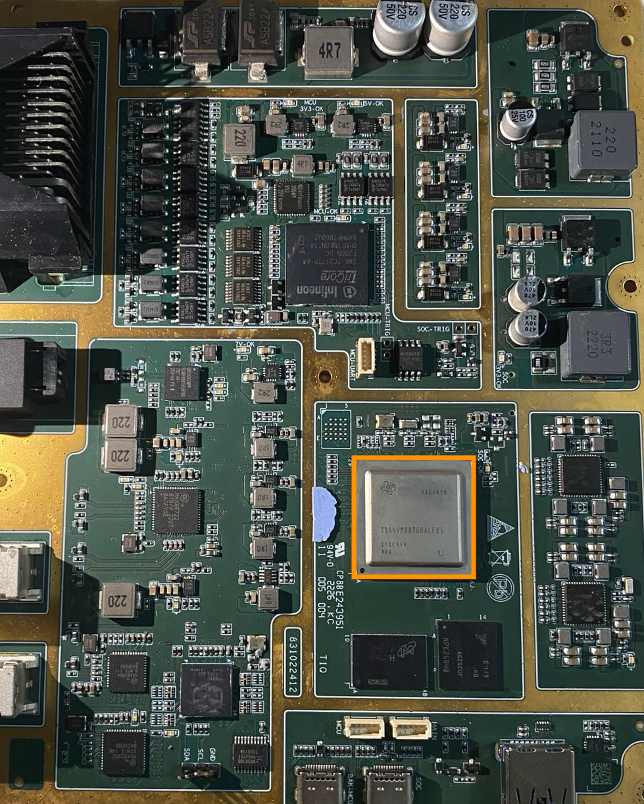
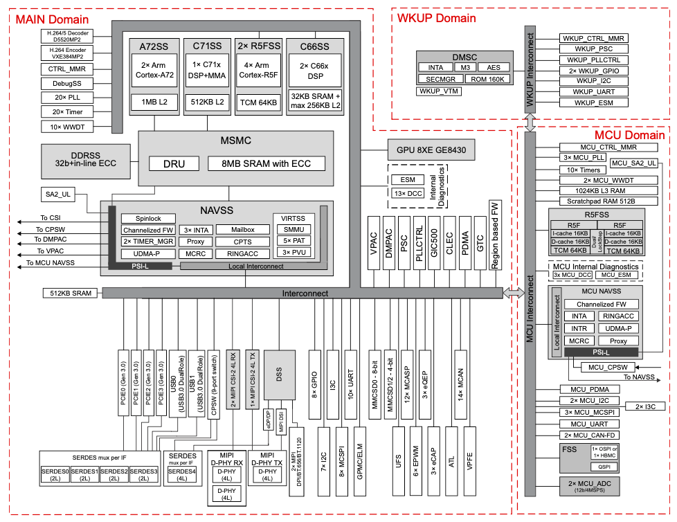
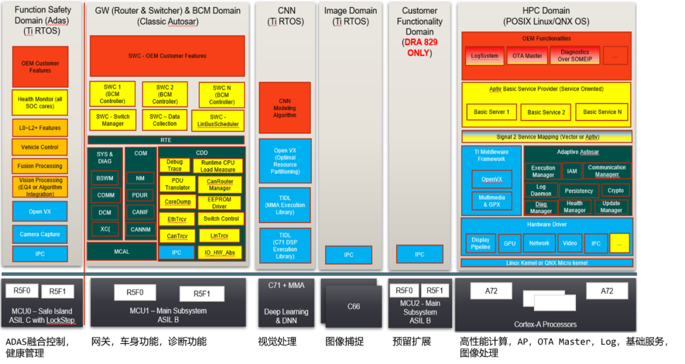
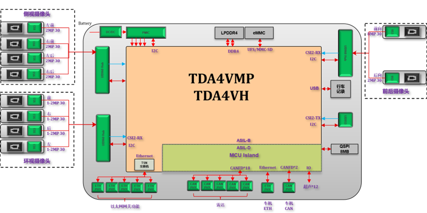
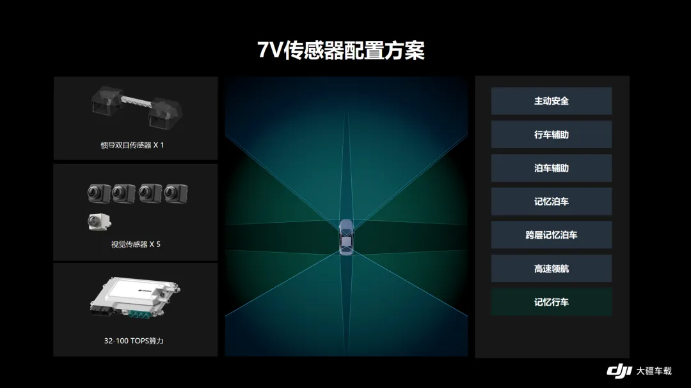
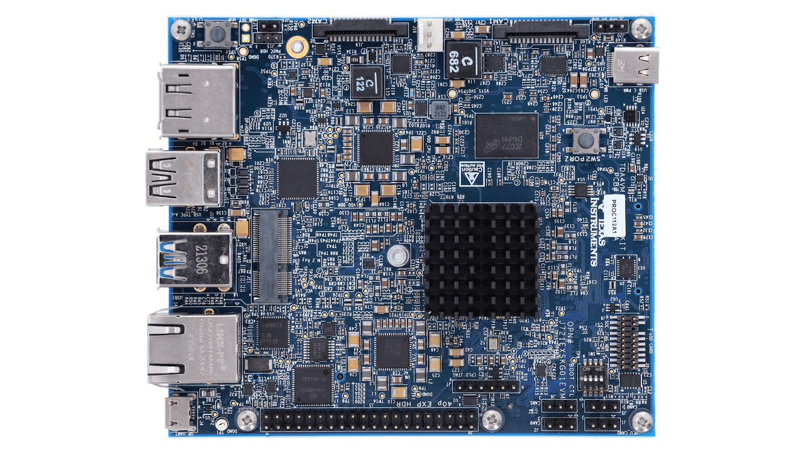
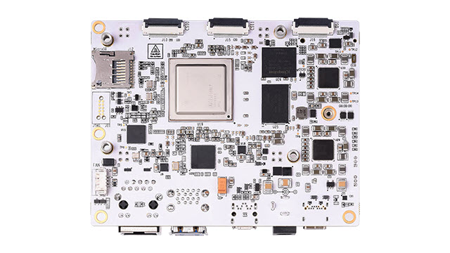

# 自动驾驶芯片-TDA4 异构核专题 (1)-系统框图

## 前言：

本专题将会深入介绍笔者开发使用两年多的一款车规级异构核--德州仪器Jacinto 7系列的TDA4。它是近期比较火的一款智能驾驶方案SoC，靠着Ti在车规芯片的老牌地位以及其低廉的价格以及强大的性能，据闻国内车场选择TDA4的车型，粗略统计大概在40%-50% 之间的覆盖率。

虽然TDA4作为车载应用居多，但其实其在智能驾驶之外的领域，如笔者所处的无人机领域、工业机器人也有量产产品，希望能以另外一个角度来介绍TDA4。

先介绍一下笔者对TDA4的开发背景：负责从0搭建开发工具链，工程模版、从0开始构建MCU核所有底层驱动和抽象层，业务组件开发移植和适配等，并成功量产出货。也是笔者第一次接触异构核开发，与之前的单片机开发思维和难度算是完全不同的一个level，接下来的文章将比较偏向于MCU侧，写这个专题的初衷是为了更加深入了解汽车行业、Autosar、MCAL开发。

说了这么多，下面就让我们看看这款芯片的具体参数吧！

###### 特别提醒：本专题所涉及的所有内容均为公开内容，不涉及NDA，可在https://www.ti.com.cn/product/zh-cn/TDA4VM及互联网中找到。

## 初识TDA4：

Jacinto7 TDA4 系列处理器是 TI 公司基于 Keystone 架构推出的最新一代汽车处理器，主要致力于辅助驾驶系统(ADAS)和自动驾驶(AD)领域芯片解决方案。TDA4 系列汽车处理器基于片上多核异构芯片架构，16nm 系统工艺不仅为芯片带来了高系统集成度，而且大幅降低了多功能高级汽车平台设计所需的外设复杂度以及成本。性能上，在提供高达 ASIL-D 的系统功能安全等级支持的同时，以领先于市场的性能/功耗比为深度学习/视觉加速提供了卓越的处理能力。

自动驾驶模块中的TDA4VM（框中）

自动驾驶模块中的TDA4VM（左上银色芯片）

我们首先打开该芯片的Technical Reference Manual (TRM)，打开后我们发现页数高达3000多页！该如何上手呢？我们认识一款芯片一般是先阅读其简介、系统框图、内存章节。本篇讲解的是系统框图章节。

### 系统框图

我们可以看到，这款SoC十分的强大，集成了MPU、MCU、DSP、ISP等。

### 处理器资源：

- **C7x** 浮点矢量 DSP，性能高达 1.0GHz、 80GFLOPS、256GOPS

- 深度学习矩阵乘法加速器 (**MMA**)，性能高达 8TOPS (8b)(频率为 1.0GHz)

- 具有图像信号处理器 (**ISP**) 和多个视觉辅助加速器 的视觉处理加速器 (**VPAC**)

- 深度和运动处理加速器 (**DMPAC**)

- 双核 64 位 Arm® **Cortex®-A72** 微处理器子系统，性

  能高达 2.0GHz

  - –  每个双核 Cortex®-A72 集群具有 1MB L2 共享缓

    存

  - –  每个 Cortex®-A72 内核具有 32KB L1 数据缓存

    和 48KB L1 指令缓存

- **六个 Arm® Cortex®-R5F MCU**，性能高达 1.0GHz

  - –  16K 指令缓存，16K 数据缓存，64K L2 TCM

  - –  隔离 MCU 子系统中有两个 Arm® Cortex®-R5F

    MCU

  - –  通用计算分区中有四个 Arm® Cortex®-R5F

    MCU

- **两个 C66x 浮点 DSP**，性能高达 1.35GHz、

  40GFLOPS、160GOPS

- **3D GPU PowerVR® Rogue 8XE GE8430**，性能高

  达 750MHz、96GFLOPS、6Gpix/s

### 外设资源

该芯片的外设资源丰富到用豪华来形容都不为过， 以TDA4VM为例，一些常用的外设资源：

- **GPIO**：2组

  - 1组（68个）在mcu域，2组在main域（256个）

- **UART**：12个

  - 10个在main域，2个在mcu域

- **CAN-FD:**16个

  - 2个在mcu域，14个在main域

- **I2C**：10个

  - 3个在mcu域，7个在main域

- **SPI**：10个

  - 3个在mcu域，7个在main域

- **ADC**：2个，每个8个通道

  - 都在mcu域

- **Timer**：30个

  - 10个在mcu域，20个在main域

- **网络相关**：

  - 内置4口网络交换机
  - 千兆以太网接口

  还有很多非常实用的外设、系统基础ip，这里就不一一列举了，具体将会在后面的文章介绍。

### 域划分

我们可以看到，这颗芯片将多种异构处理器及各种加速器件集成在了一颗芯片上，并通过芯片间内联（Interconnect）打通桥梁。整个芯片被红色虚线框划分为了三部份，分别是：

- WKUP Domain 
- MCU Domain
- MAIN Domain

为什么要这样划分呢？是为了实现不同的安全等级，mcu岛的电源、内存、外设等都是隔离的。当main域有异常时，如电源故障、时钟故障、内存溢出等也不会影响到mcu域，因此mcu域可以做到最高安全等级ASIL-D。

我们在做功能划分的时候，会根据应用的不同安全等级划分要运行核心，比如关键的ADAS融合控制，就会放到mcu域，而安全要求不这么高的功能，如网关、日志、诊断功能，就会放在ASIL-B等级的main域mcu中。

TDA4核功能划分案例

我们继续看TRM：

#### WKUP 域

TDA4运用了一种叫做Device Management 设备管理的设计模式，这在高度集成，具备复杂功能和安全性较高的芯片中很常见。

一般分为三个部分，不同厂商有着不同的命名：

- **System Management Unit(SMU) - 系统管理单元**
  - 系统管理单元负责管理整个系统的各种资源和功能。它通常是一种硬件单元，位于处理器或系统芯片中。
  - SMU 可能负责管理电源、时钟、温度、电压等系统资源，以及监控系统的运行状态和性能指标。
  - 在嵌入式系统中，SMU 可能会负责处理系统的各种事件和中断，调度系统资源，确保系统的正常运行和稳定性。

- **Power Management Unit (PMU) - 电源管理单元**
  - 电源管理单元负责管理系统的电源供应和功耗消耗。它通常是一种硬件单元，位于处理器或系统芯片中。
  - PMU 可能负责管理系统的电源模式、电源转换、电压调节、功耗分析等功能，以优化系统的能耗和性能。
  - 在移动设备和便携式系统中，PMU 尤其重要，它可以帮助延长电池寿命，提高系统的续航时间。
- **Security Subsystem - 安全子系统** 
  - 安全子系统是一种用于处理系统安全性的功能模块，通常由硬件和软件组成。
  - 安全子系统负责保护系统的机密性、完整性和可用性，防止未经授权的访问、数据泄露或者系统遭受攻击。
  - 它可能包括身份验证和访问控制、加密和解密、安全引导和认证、安全监控和审计、漏洞管理和安全更新等功能。

在TDA4中，这三个部分全部通过一颗独立的MCU来管理和实现，Ti称之为：**Device Management and Security Controller(DMSC)**，我们看框图可以看到，在wkup域中，有一颗ARM Cortex-M3处理器。这颗处理器就是运行着DMSC的固件，管理着整个TDA4的启动顺序、设备管理、电源管理和安全。有以下功能：

- 电源管理 Power Management (PM)
  - 热管理
  - 时钟管理
  - 低功耗管理
- 资源分配 Resource Management (RM)
  - 中断资源
  - DMA资源

- 安全管理 Secure Management：

  - 固件根信任

  - 固件安全加载

  - 防火墙

  - AES引擎

  - JTAG锁

    

> 📝
>
> 从经典MCU开发转到TDA4开发的过程中，笔者觉得最大的改变就是TDA4采用了统一设备管理的模式。以前在典型的MCU中使用DMA、中断、外设资源直接调用就可以了，而到了TDA4上，都需要通过DMSC来申请，这其中就会有很多坑，之后会有专题讲到。

> 💡
>
> 在一些先进SoC设计中，也会使用单独的MCU作为"DMSC"，统一管理整颗芯片的电源、安全功能。如苹果A系列、M系列、Apple Watch的S系列SoC，就使用一个ARM Cortex-L4核作为“DMSC”，苹果称之为安全隔区处理器。
>
> 安全隔区处理器为安全隔区提供了主要的计算能力。为了提供最高级别的隔离，安全隔区处理器专供安全隔区使用。这可帮助阻止旁路攻击的发生，这种攻击依赖于恶意软件使用与被攻击目标软件相同的执行核。
>
> 安全隔区处理器运行 Apple 定制版的 L4 微内核。安全隔区处理器设计为以较低时钟速度高效运行，这有助于防范时钟攻击和功耗攻击。从 A11 和 S4 开始，安全隔区处理器包括内存受保护的引擎和具备反重放功能的加密内存、安全启动、专用的随机数生成器和独有的 AES 引擎。
>
> 扩展阅读：[Apple 平台安全保护 安全隔区](https://support.apple.com/zh-cn/guide/security/welcome/1/web)

#### MCU 域

在mcu域中，ti使用了一种"chip-in-a-chip"理念，该域与wkup域类似，与芯片其他部分是完全独立的，具有单独的电源、时钟、复位、外设，因此形象的称之为“island” 岛。这确保了当其他核跑死的时候，该域内的核及其外设还能够正常工作。可以理解为是MPU-MCU分立架构中的MCU。

##### 该域处理器特性：

- ARM Cortex-R5F@1Ghz MCU x2  （可配置为单独运行或者锁步）
- 64KB L2  TCM RAM  （每个核）
- 1024KB L3 SRAM shared （两个核心共享）
- 浮点运算单元（VFPv3）
- JTAG调试

##### 外设资源：

- **UART x1**

- **I2C x2**

- I3C x2

- **SPI x3**

- OSPI x1

- QSPI x1

- ADC x2

- **CANFD x2**

- Timer x10

- WDT x2

- Gigabit Ethernet Switch (4口千兆以太网交换机)

在MCU域中有两个R5F的实时核， 我们用于处理对实时性以及延迟性要求较高的数据信息，具备最高安全等级 ASIL-D级别。在上面我们运行着实时操作系统，比如FreeRTOS、VxWorks、CP-Autosar。前者为TI官方开发套件中已提供，后者为第三方厂家适配。有一点需要注意的是，官方所移植的FreeRTOS并不支持中断嵌套，不支持SMP。

笔者开发的重心就在MCU核（R5F）上。

> 📝
>
> 锁步：LockStep中文翻译为“锁步”，支持LockStep架构的CPU称为‘锁步核”。锁步核指的是由两个CPU构成的互相监控的冗余系统该系统可以不间断的检查程序运行的正确性，并能够检测出处理器错误，建立故障抑制区，防止故障蔓延。
>
> 在航空器、汽车等很多需要高可靠性计算的系统中，通常采用冗余技术。随着冗余系统带来的功耗、体积、重量、管理等方面的问题越来越严重，要求处理器达到很高的可靠性以降低系统冗余度。LockStep处理器架构能够迅速监测处理器运行的错误，进行故障隔离，防止故障蔓延，在处理器级实现高可靠性。进而，LockStep 处理器架构作为新型高可靠计算系统的关键技术，可以实现信息处理的高完整性和高可用性。

### MAIN 域

MAIN域的东西就可多了，在前面的处理器资源章节已经有详细介绍，这里就不赘述了，挑重点来讲：有两个A72大核，主频为2GHz，4个R5F小核，主频为1GHz，2个C66x，2个C7x。还有丰富的外设资源。

其中：A72用于运行Linux等上层操作系统；4个R5F实时核运行RTOS，用于处理实时性以及延迟性要求较高的应用，如超声波雷达模块的驱动和数据处理。 C66x、C7x、MMA可用于图像、算法处理；GPU、视频编解码模块可以加速视频流处理；显示、音频单元可以做多媒体相关业务；

TDA4异构核有个特点：**跨域访问**：**比如在main域的外设资源，可以被mcu域访问**，**mcu域也可以访问其他域的共享内存**，这个大大的提高了MCU域的外设扩展性和并行处理能力。

比如：

**Q：**我需要4路can口链接子设备，但mcu域只有2路怎么办？

**A：** 将2路main域的can路由到mcu域即可。

> 📝跨域访问也是从经典MCU开发转到TDA4开发的过程中需要转变的一个思路，也有很多坑，后面会详细描述跨域访问的优缺点。

看到这里，可能有人会问，这种跨域访问是通过什么机制实现的呢？我们看回wkup域、mcu域、main域都有一个模块-- `Interconnect`，这是TDA4实现跨域访问的基础设施，是通过硬件层面的switch fabrics来实现快速、低延时的数据交换、外设控制等。

这在后面的章节会详细介绍。

## 应用：

前面介绍了这么多纸面参数，略显枯燥，最后让我们看看TDA4在市场上的应用吧！

> 本段文章来自Ti公众号文章：[技术干货｜TDA4 行泊一体，打开智能驾驶新篇章](https://mp.weixin.qq.com/s/bi9ion82UDJSGillA0DdXw)
>
> **单 TDA4VH/TDA4VM PLUS 行泊一体化方案如下图所示，**它具有更高的算力（单芯片可以达 24-32TOPS），可以接入更多的摄像头。比如下面的 10V5R 的方案，使用 **10 个摄像头和 5 个毫米波雷达**实现了行泊一体的方案。
>
> 
>
> **功能方面：**单芯片可实现丰富的行车和泊车的功能
>
> - **行车方面，**可实现盲区检测 (BSD)、开门预警 (DOW)、车道偏离预警 (LDW)、前向碰撞预警 (FCW)、智能远光灯控制 (IHC)、前方穿行预警 (FCTA)、后方穿行预警 (RCTA)、后方碰撞预警 (RCW)、自适应巡航 (ACC)、车道保持辅助 (LKA)、手动变道 (PLC)、交通拥堵辅助 (TJA)、高速辅助驾驶 (HWA)、自动紧急制动 (AEB)、交互式速公路自动驾驶 (HWP)、交互式高速公路拥堵自动驾驶 (TJP)、自动辅助导航驾驶 (NOA) 等功能；
> - **泊车方面，**可实现全景功能 (AVM)、自动泊车辅助 (APA)、遥控泊车辅助 (RPA)、家庭区域记忆泊车 (HAVP) 等功能。
>
> **安全方面：**TI Jacinto™7 处理器集成 HSM 实现信息保密，同时内部集成了 ASIL D 的 MCU。从而使用户的产品能够满足汽车的质量和功能安全以及信息安全目标。
>
> **可扩展性：**高性能片上系统 (SoC) 的重要性在于它可以进行并行处理，TI Jacinto7 处理器属于异构多核的架构，除了 ARM A72、数字信号处理 C7x/C66、MCU R5F 等计算核，内部 VPAC、DMPAC 等加速器有效降低了主核的负载，从而使得应用可以灵活部署，推动持续的功能定制、扩展。
>
> **算力方面：**Jacinto7 为用户提供了单芯片 0~32T 的算力，单个 C7x/MMA 可以实现 8TOPS 算力，系列根据配置分为不同版本，可以满足降本和功能扩展需求。
>
> **成本方面：**TDA4 系列以先进的集成度，有效地节约了系统成本。TDA4 系列处理器集成了 ASIL-D MCU 核心，不再需要外部 MCU；接口丰富，SOC 集成了多路 CAN-FD 接口和以太网、PCIe 交换机等；内置 ISP，摄像头无需外置 ISP。

### 落地产品：

[「成行平台」首款量产车型上市交付，12.58万元开上高阶智能车](https://mp.weixin.qq.com/s/15OcowCO2P8g-XBFAGYsKw)

宝骏云朵的智驾控制器

[极速拍档  开车需要动手吗？](https://www.bilibili.com/video/BV1dm4y157Bu)

## 扩展阅读：

[智能驾驶域控制器SoC选型](https://mp.weixin.qq.com/s/EV47LRQ47Li3Z07-UEevfw)

## Get started：

TDA4的上手比较难，但好消息是原厂及一些厂商配套了多款开发板以及丰富的demo，我觉得对用户比较友好的开发板有：

**SK-TDA4VM** -- TDA4VM Edge AI 视觉系统处理器入门套件（官方）

**BEAGL-BONE-AI-64** 基于 Jacinto™ TDA4VM Arm® Cortex®-72 处理器的 BeagleBone® AI-64 嵌入式计算板 （知名开源开发板制造商）

## 总结

本文浅显介绍了一下这款极为强大的车规级异构SoC，并讲解了下该SoC的特性。在接下来的文章中，会深入介绍各处理器架构，异构核启动流程，芯片间互联、DMSC设备管理、NAVSS导航子系统、外设等等。由于该芯片极其复杂，笔者接触开发这款芯片时间也就2年多，不敢说精通，如果有错误，欢迎指正，谢谢！
