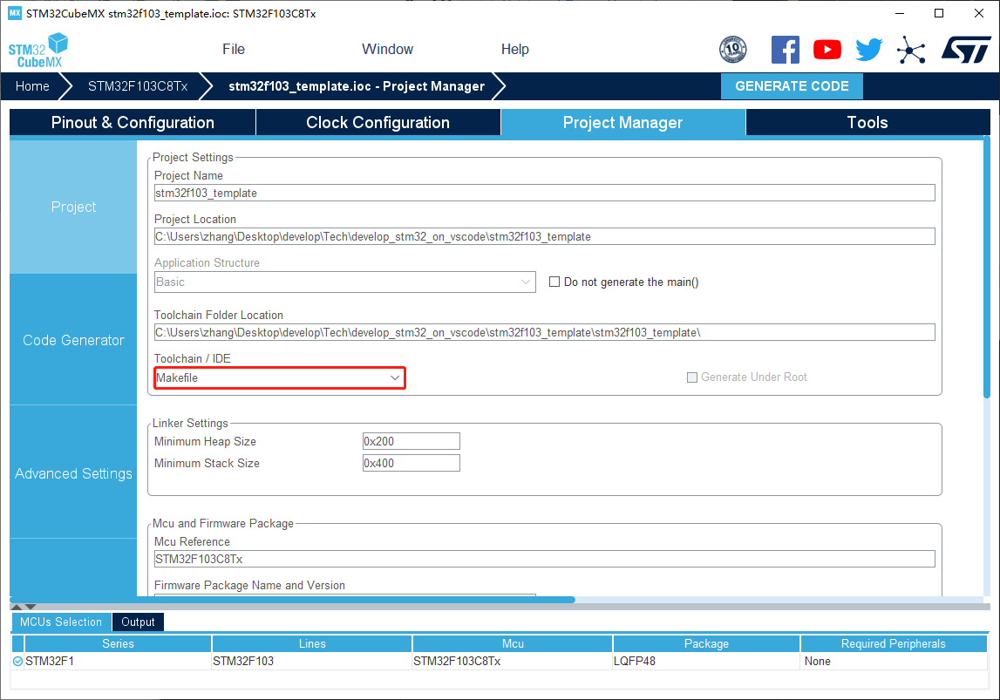
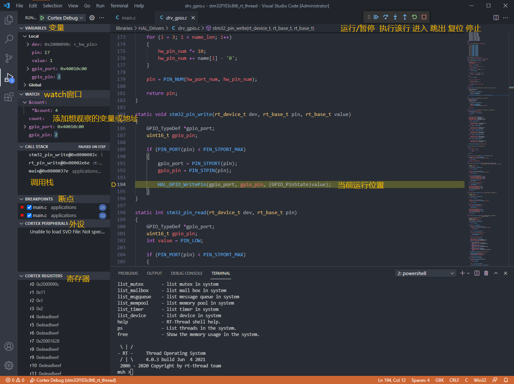

# 使用VSCODE开发调试STM32/GD32

&nbsp;&nbsp;熟悉单片机开发的朋友对Keil(MDK)肯定不会陌生,STM32开发都离不开它,他承担了代码编辑、在线调试、仿真等功能。说起VSCode,可能有些小伙伴并不熟悉,它是微软开发的轻量代码编辑器,功能十分强大,丰富的插件,UI也非常美观,开源、免费,近来受到越来越多开发者的喜爱。


 <center>Keil5</center>


 <center>VSCode</center>


&nbsp;&nbsp;其实VSCode也能够承担Keil的任务,实现单片机开发调试工作,在线调试等功能。由于都是使用开源软件,因此完全免费,而不像keil一样需要收费,并且能够跨平台开发,不再仅限于Windows平台了,无论在windows下还是mac OS X、M1 mac,都能方便的调板子。接下来,我将会手把手教你如何使用VSCode实现对STM32的开发,在线调试及下载。

 
  <center>在线调试STM32</center>
  
## 配置工具链
配置工具链的步骤如下:
1. 配置交叉编译工具链(gcc-arm-none-eabi)
2. 安装vscode,Cortex-Debug插件
3. 根据硬件配置Cortex-Debug插件
4. 准备或转换成基于makefile构建的工程
5. 编码 运行 调试!

### 配置交叉编译工具链
1. 下载编译工具链,这里我用的是gcc-arm-none-eabi-6-2017-q2这个版本的工具链,大家可以在
[arm官网](https://developer.arm.com/tools-and-software/open-source-software/developer-tools/gnu-toolchain/gnu-rm/downloads)下载合适的版本。

2. 下载安装,[cygwin](https://cygwin.com/install.html),cygwin是Windows下的Linux开发环境.
3. 下载make
如果是windows用户,需要下载[Make For Windows](http://www.equation.com/servlet/equation.cmd?fa=make)
最后,将上述的添加到系统环境变量中,这里以windows为例：
    

    &nbsp;&nbsp;至此,工具链的配置完成,打开命令行或VSCode中的Terminal输入make –v查看编译链版本,若能正常显示版本信息,则说明配置无误,若报错,请检查环境变量。
    

4. 安装VScode,安装Cortex-Debug插件工具以及C/C++插件
  在插件市场中搜索C/C++,Cortex-Debug并安装。

    
    

## 配置Cortex-Debug
&nbsp;&nbsp;安装完成后,点击齿轮打开Cortex-Debug的设置,找到调试器服务器的路径选项,填入对应的路径,笔者用的是jlink,因此在Jlink GDBServer Path中填入GDBServer的路径


至此我们的环境已经准备好,接下来我们就可以准备愉快的编码了！

## 构建工程
&nbsp;&nbsp;需要注意的是,此方法需要的是基于makefile构建的工程,并不能直接编译keil的工程。构建makefile的工具有很多种,比如scons,或者直接使用STM32CubeMX生成基于makefile构建的工程,当然也可以手写；如果大家使用的是基于[rt-thread](https://www.rt-thread.org/)的工程,则一键即可生成makefile（其就是scons构建的）。

构建可使用vscode编译调试的工程步骤如下:
1. 准备好基于makefile构建的工程
2. 配置项目中`.vscode`文件夹中的`launch.json`,选择对应的调试器、调试接口、型号、elf文件路径
3. 编译运行

&nbsp;&nbsp;接下来教大家如何用STM32CubeMX以及rt-thread的env工具生成makefile工程。这两份工程下载链接在文末
### 基于STM32CubeMX
&nbsp;&nbsp;在CubeMX中配置各种外设后,我们在ProjectManager中的Toolchain/IDE中选择makefile工程,点击Generate code即可。

打开工程文件夹,即可看到makefile文件


### 基于rt-thread
&nbsp;&nbsp;在rt-thread工程中,我们在env中输入`scons –target=makefile`
即可生成makefile文件


## 编译工程
我们用vscode打开工程,新建一个Terminal,输入`make`,即可编译。


编译成功,生成bin文件及elf文件。


编译失败,则像keil一样,很方便定位错误。

## 下载及在线调试
&nbsp;&nbsp;在线调试之前,需要配置一下运行选项,以及配置好调试器。在项目中的`.vscode`文件夹中打开`launch.json`,填入以下内容,若无`.vscode`文件夹或`launch.json`,新建即可。


&nbsp;&nbsp;笔者所使用的调试器为jlink调试器,swd接口,elf调试文件名字为rtthread.elf,大家按照自己的实际情况填入。

编辑`launch.json`并保存
```json
{
    "version": "0.2.0",
    "configurations": [
        {
            "name": "Cortex Debug",
            "cwd": "${workspaceRoot}",
            "executable": "${workspaceFolder}/rtthread.elf",//elf文件
            "request": "launch",
            "type": "cortex-debug",
            "servertype": "jlink",//调试器类型
            "interface": "swd",//调试器接口
            "device": "STM32F103C8",//MCU型号
        },
    ]
}
```
&nbsp;&nbsp;接下来就可以下载及在线调试,点击VSCode左侧的Debug按钮,然后点击运行按钮。或者直接按`F5`。
    

&nbsp;&nbsp;按下运行按钮后我们会看到下载的进度条,下载完成后将自动进入在线调试页面。
    

&nbsp;&nbsp;和keil一样,在线调试能打断点,能单步执行,watch、call stack、memory、peripherals、registers窗口样样齐全。
    
&nbsp;&nbsp;举个🍈,如果我想看`count`这个变量当前的值,则在该行打个断点,右键这个变量,选择add to watch即可。
    

&nbsp;&nbsp;在左侧的watch窗口中,我们即可看到`count`变量当前值,watch窗口还支持输入表达式,如果想看`count`的内存地址,则输入`&count`就可以看到了。
    
&nbsp;&nbsp;再举个🍈,如果我想看`rt_pin_write()`这个函数的调用关系,我们在`rt_pin_write(LED4_PIN, PIN_HIGH)`这行打断点,运行到该行后点击step into(F11)进行单步跟踪。不断的单步运行我们可以发现,该函数最后调用了stm32 hal库中的GPIO接口`HAL_GPIO_WritePin()`,最终操作GPIO的端口位设置/清除寄存器实现GPIO引脚输出高电平。在左边的CALL_STACK串口,可以看出调用关系。
    

### 串口调试
&nbsp;&nbsp;笔者在开发ESP32时发现esp-idf中自带了一个非常好用的串口工具--`idf_monitor.py`,运行方法也很简单,输入指定的端口号,波特率,elf文件即可。工具及运行脚本的下载链接在文末。
例如：

    python .\idf_monitor.py --port \\.\COM6 --baud 115200 .\rtthread.elf
&nbsp;&nbsp;这样我们就可以在VSCODE中使用串口了。
 

## 总结
&nbsp;&nbsp;vscode是一个非常强大的代码编辑器,它可以做的事情仅不止代码编辑,还可以运行调试STM32(GD32),具有轻量、免费、易用、跨平台等等优点。笔者目前的主线项目就是采用vscode搭建的。
&nbsp;&nbsp;文章中所提及到的例程及串口工具下载链接：`https://github.com/MrzhangF1ghter/TechTips`