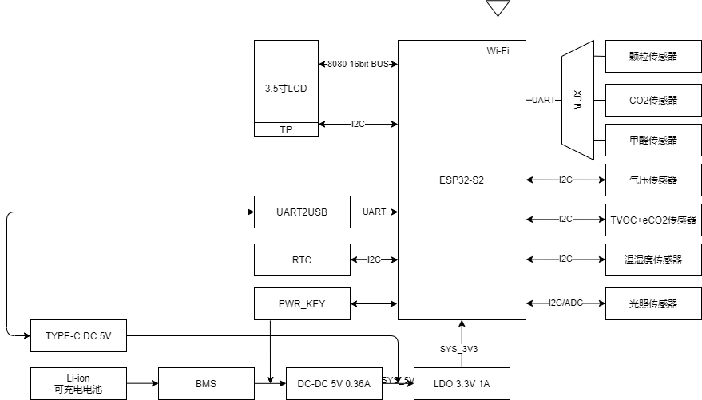
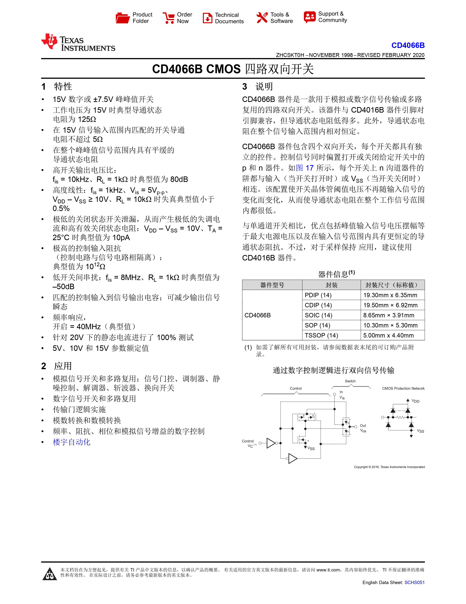
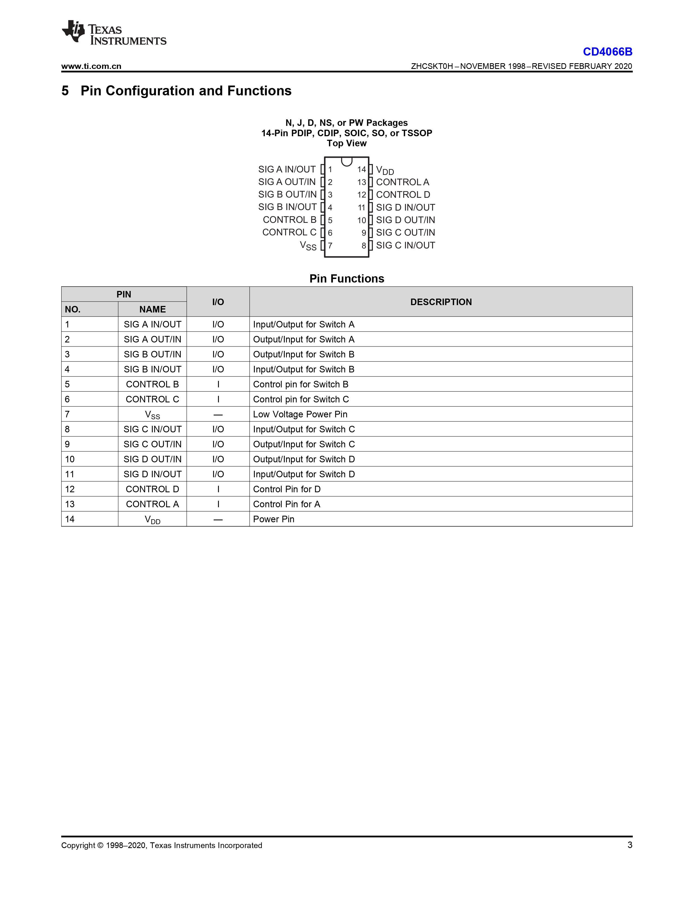
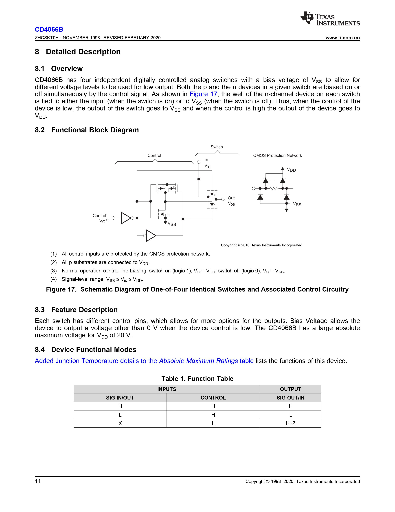
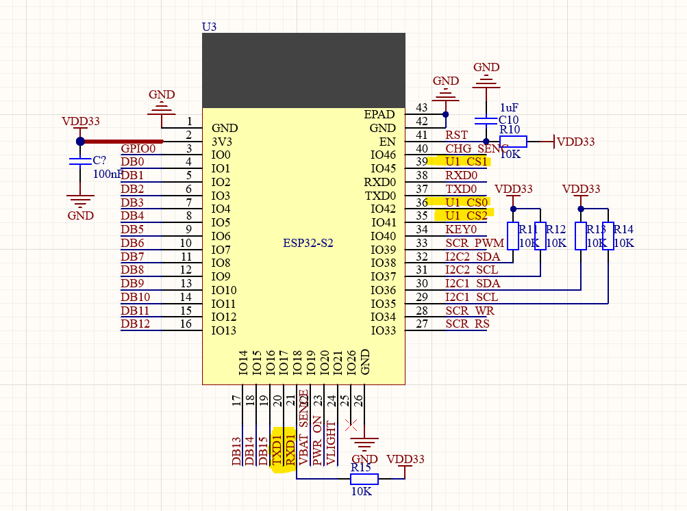
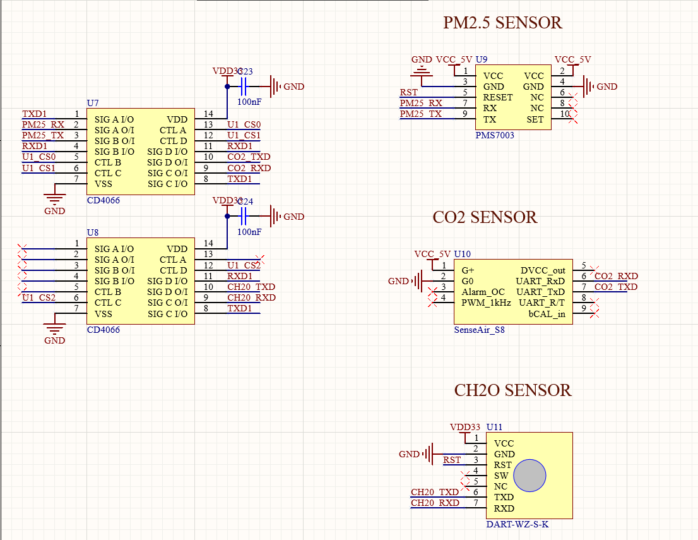
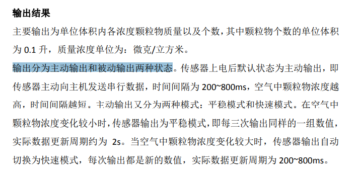
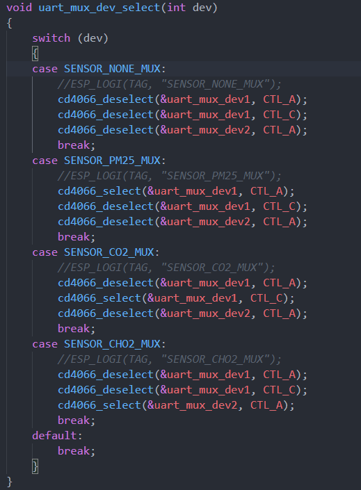
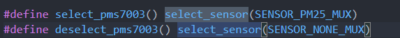

# 串口的复用方法

## 背景
&nbsp;&nbsp;不知道大家在产品开发中有没有遇到过串口不够用的情况，在成本的权衡下，一些MCU并非能够提供足够的串口外设，比如ESP8266,ESP32这一些SoC，或者我们需要用到的串口设备特别多的时候，该如何解决呢？

## 设计

&nbsp;&nbsp;笔者之前自己的项目中用到SoC是ESP32-S2,然而该芯片只提供2路串口，1路是固定的debug口，只剩下一个空闲的串口可用，但是该产品的3个外设用到通讯接口都为串口，那该如何实现一个串口挂3个设备呢？大家第一时间便能想到，那我分时复用嘛，没错，我们可以使用轮询的方法配合开关实现一拖n路串口。一番设计后，硬件框图见下图（主要关注右上角）。

## 实现

### 硬件设计
&nbsp;&nbsp;回到前面的问题提出，我们需要一种手段去"片选"对应的外设，像控制开关一样，实际中器件是什么呢，没错，就叫模拟开关。这里我选用了德州仪器的CD4066这一款开关芯片，他是一款CMOS工艺的四路双向开关，支持15V数字或+-7.5Vpp，我们串口电平为3.3V的TTL，满足我们的需求。
其规格书介绍如下：

框图如下：

&nbsp;&nbsp;通过规格书不难看出，通过控制CONTORL引脚，可以选通或关闭对应的SIG引脚，高电平选通，低电平关闭。那么我们将串口的TX引脚接到SIGx_I/O，然后将从设备的RX接到SIGx_O/I，再通过GPIO去控制通断，即可实现串口复用。如下图所示：

PCB上的CD4066

### 软件设计
&nbsp;&nbsp;在软件设计上，我们需要注意的是，该方法属于分时复用，且从设备可控，从设备需要支持主动查询（如本项目中用到的PM2.5传感器PMS7003），或有中断引脚通知串口数据到来。整个程序的逻辑是轮询设备，当设备占有该时间片时，主设备（MCU）端主动发起通讯，查询传感器状态。若从设备不支持查询模式，则通过中断引脚切换到该设备进行数据接收。

PMS7003传感器支持主动查询模式

&nbsp;

部分代码如下：

 

三个传感器运行效果如下：  

## 总结
&nbsp;&nbsp;本文介绍了一种对于串口资源较少的MCU系统串口复用的方法，其实这种方法不局限于串口复用，也可以用于SPI Flash复用等地方。
