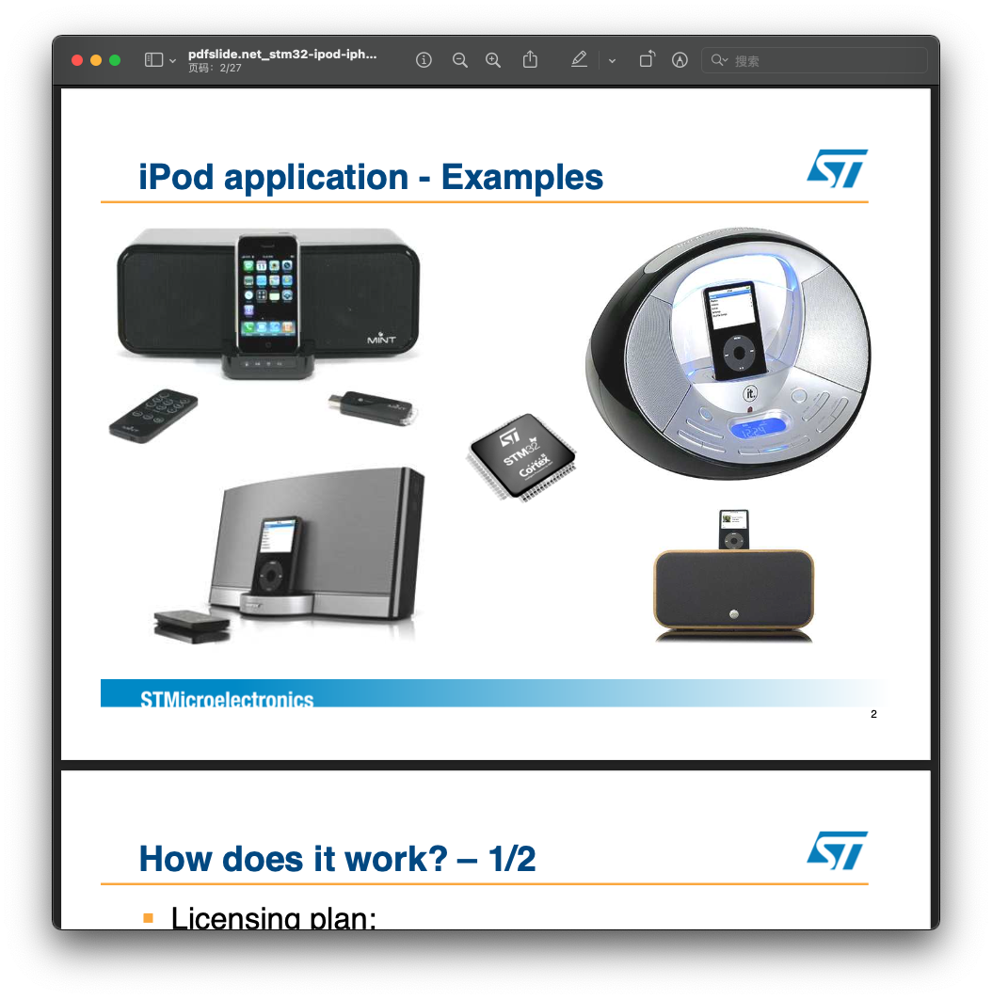
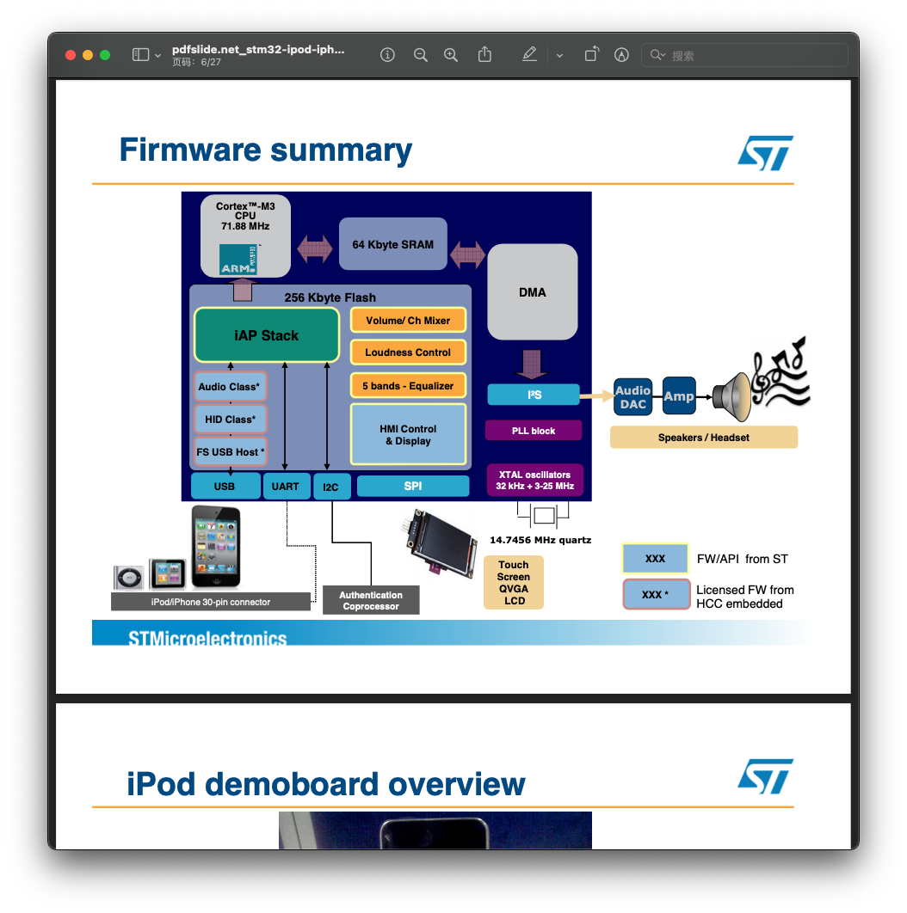
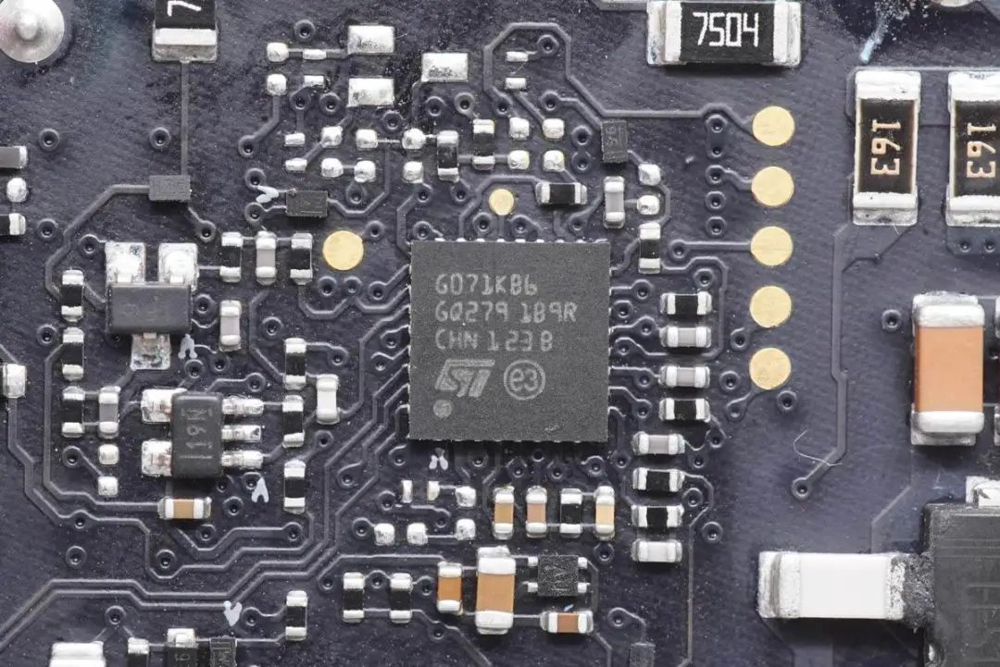
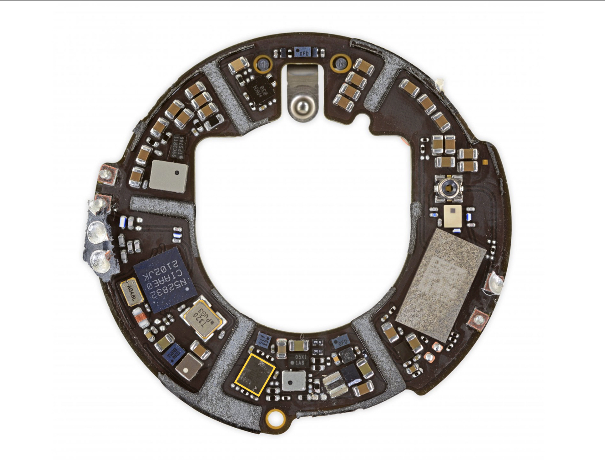
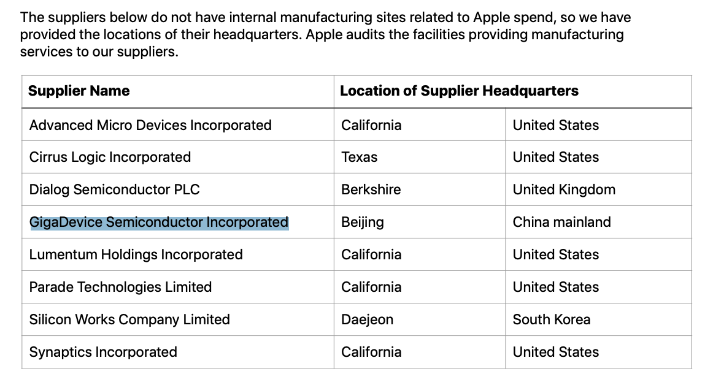

# STM32 inside Apple products
# 前言
笔者为苹果用户已经有十余年，从攒钱购买第一款苹果设备--(iPod Shuffle)到配齐全家桶，对设计理念非常的欣赏，每次发布新产品都会去[ifixit](us.ifixit.com)看其拆解，其内在设计真的贯彻了乔布斯的设计哲学，在用户看不到的电路板上都有美学考究。作为嵌入式从业者，对其mcu(微控制器)选型和功能实现是非常好奇的，看了这么多拆解发现，苹果对我日常使用的stm32单片机似乎非常的有感情，几乎每款设备都有其身影，接下来就看看这些设备的拆解吧！   
*下文关于mcu功能猜测并非全部准确，欢迎纠正。*  
# 1.耳机
## AirPods
<!-- https://www.ifixit.com/Teardown/AirPods+Teardown/75578 -->

$\color{#C0221B}{●}$ [STM32L072VZ](https://www.st.com/content/st_com/en/products/microcontrollers-microprocessors/stm32-32-bit-arm-cortex-mcus/stm32-ultra-low-power-mcus/stm32l0-series/stm32l0x2/stm32l072vz.html) ARM Cortex-M0+ MCU   
这是一款超低功耗的m0内核单片机，带usb,adc,dac,i2c等外设。   
实现充电仓功能，如dfu(usb),指示灯(pwm),舱门检测(霍尔+adc),电源管理(adc),耳机通讯(i2c/私有协议？)   
**架构:** ARM Cortex-M0+  
**主频:** 32MHz  
**RAM:** 20KB  
**Flash:** 192KB  
**IOs:** 84   
**价格:** 2.682$ (10ku)

## AirPods Pro
<!-- https://www.ifixit.com/Teardown/AirPods+Pro+Teardown/127551 -->

$\color{#B82617}{●}$ [STM32L476MG](https://www.st.com/en/microcontrollers-microprocessors/stm32l476mg.html) ARM Cortex-M4 MCU
*与1代耳机相比，升级为M4内核，该mcu有更高的主频，可能用于处理无线充电协议相关内容？还带内存读保护，防止代码被窃取*   
**架构:** ARM Cortex-M4  
**主频:** 80MHz  
**RAM:** 128KB  
**Flash:** 1024KB   
**IOs:** 65   
**价格:** 5.094$ (10ku)

## AirPods Max
<!-- https://www.ifixit.com/Teardown/AirPods+Max+Teardown/139369 -->

 
 

$\color{#B82617}{●}$ [STM32L496QG](https://www.st.com/content/st_com/en/products/microcontrollers-microprocessors/stm32-32-bit-arm-cortex-mcus/stm32-ultra-low-power-mcus/stm32l4-series/stm32l4x6/stm32l496qg.html) ARM Cortex-M4 MCU
这是一款m4内核的mcu，带完整的dsp指令集，带usb2.0全速,音频sai,i2c,spi,adc,dac等接口。   
实现耳机功能，如dfu(usb),指示灯(pwm),陀螺仪（i2c/spi),佩戴检测(霍尔，光感，adc/i2c),电源管理(adc),音频数据处理？（mcu作解码，然后把pcm通过sai送到外挂codec。但看板上还有自家音频处理的H1,大概率是都在H1上做了）。   
**架构:** ARM Cortex-M4  
**主频:** 80MHz  
**RAM:** 320KB  
**Flash:** 1024KB   
**IOs:** 108   
**价格:** 6.389$ (10ku)

# 2.配件
## iPod 配件
在配件中意法半导体算是战略合作伙伴了，从iPod时期到现今，几乎每种外设都能看到stm32的身影。第三方申请MFi，意法半导体提供iAP库实现与iPod的通信。

## MagSafe charger

$\color{#B82617}{●}$ [STM32F446MEY6](https://www.st.com/content/st_com/en/products/microcontrollers-microprocessors/stm32-32-bit-arm-cortex-mcus/stm32-high-performance-mcus/stm32f4-series/stm32f446/stm32f446me.html) ARM Cortex-M4 MCU
*估计是用于充电检测，协议等。ps：为啥用这么高主频？*  
这是一款m4内核的mcu，带完整的dsp指令集，带usb2.0全速,音频sai,i2c,spi,adc,dac,cec等接口。   
实现无线充电器相关功能，如dfu(usb)，无线握手协议等，充电监测等。  
**架构:** ARM Cortex-M4   
**主频:** 180MHz   
**RAM:** 128KB   
**Flash:** 512KB   
**IOs:** 63   
**价格:** 3.788$ (10ku)

## MagSafe 外接电池

$\color{#B82617}{●}$ [STM32L4S5ZI](https://www.st.com/en/microcontrollers-microprocessors/stm32l4s5zi.html) ARM Cortex-M4 MCU
这是一款低功耗m4内核的mcu，带完整的dsp指令集，带usb2.0全速,音频sai,i2c,spi,adc,dac,cec等接口。   
实现无线充电宝相关功能，如dfu(usb)，无线握手协议等，充电监测等。  
**架构:** ARM Cortex-M4  
**主频:** 120MHz   
**RAM:** 640KB   
**Flash:** 2048KB    
**IOs:** 110   
**价格:** 8.026$ (10ku)

## MacBook充电器
### 140W 氮化镓充电器

$\color{#000000}{●}$ [STM32G071KB](https://www.st.com/content/st_com/en/products/microcontrollers-microprocessors/stm32-32-bit-arm-cortex-mcus/stm32-mainstream-mcus/stm32g0-series/stm32g0x1/stm32g071kb.html#sample-buy) ARM Cortex-M0+ MCU   
这是一款低功耗m0+内核的mcu，带type-c电源传输控制。    
*估计实现type-c协议栈，该充电器使用是刚发布的USB PD3.1快充协议   
**架构:** ARM Cortex-M0+   
**主频:** 64MHz   
**RAM:** 36KB   
**Flash:** 128KB    
**IOs:** 30   
**价格:** 1.481$ (10ku)

## Magic Keyboard

## Magic Mouse

- ## Magic TrackPad

   

## MacBook中键盘与触控板

$\color{#FF912D}{●}$ $\color{#21B5DF}{●}$ $\color{#FF8E2E}{●}$ [STM32F103VB ](http://www.st.com/web/en/catalog/mmc/FM141/SC1169/SS1031/LN1565/PF164493) ARM Cortex-M3 MCU

这款mcu相信嵌入式行业的朋友都不陌生了吧，就是我们熟悉的stm32f103系列，适用产品特别广，从消费电子，电机控制、逆变器、打印机到医疗、工控plc，都有它的身影。带usb2.0全速接口,adc,dac,spi,i2c,uart等外设。    
用于实现HID设备枚举(usb),与笔记本SMC通讯(spi),按键矩阵识别(gpio),触摸轨迹识别(adc),线性马达Taptic Engine(pwm),背光(pwm/dac),电源管理(adc)。    
*键盘、鼠标、触摸板包括macbook上的键盘及触控板/iPad键盘盖都使用同一款或近似MCU,利于bom归一；鼠标跟触控板功能几乎一致，估计这几个产品代码差异不大，有机会看看能在串口读出什么数据*   

**架构:** ARM Cortex-M3  
**主频:** 72MHz   
**RAM:** 20KB
**Flash:** 128KB   
**IOs:** 80   
**价格:** 3.343$ (10ku)

## Apple Pencil
<!-- https://www.ifixit.com/Teardown/Apple+Pencil+Teardown/52955 -->

$\color{#B82617}{●}$ [STM32L151UCY6](http://www.st.com/web/en/resource/technical/document/datasheet/DM00048356.pdf) ARM Cortex-M3 MCU
这款mcu为低功耗型号，flash和ram带ecc校验，包含高达23个电容感应通道，带i2c,spi等接口，可实现笔迹传感器识别(cap),姿态imu(i2c/spi)。  
**架构:** ARM Cortex-M3  
**主频:** 32MHz   
**RAM:** 32KB   
**Flash:** 256KB    
**IOs:** 51   
**价格:** 2.56$ (10ku)

$\color{#F1DB36}{●}$ [STM32L052T8](https://www.st.com/en/microcontrollers-microprocessors/stm32l052t8.html) ARM Cortex-M0+ MCU
这款mcu为低功耗型号，flash和ram带ecc校验，包含高达24个电容感应通道，带i2c,spi等接口，可实现笔迹传感器识别(cap),姿态imu(i2c/spi)。
*1代2代使用，估计用于其他不需耗ram的业务*   
**架构:** ARM Cortex-M0+  
**主频:** 32MHz   
**RAM:** 8KB   
**Flash:** 64KB    
**IOs:** 29   
**价格:** 1.855$ (10ku)

$\color{#000000}{●}$ [STM32L476JGY6](https://www.st.com/content/st_com/en/products/microcontrollers-microprocessors/stm32-32-bit-arm-cortex-mcus/stm32-ultra-low-power-mcus/stm32l4-series/stm32l4x6/stm32l476jg.html#sample-buy) ARM Cortex-M4 MCU
这款mcu为m4内核，包含高达24个电容感应通道，在二代笔中使用，性能及内存资源更加丰富，可以加入更多复杂的算法了。  
*2代使用，看配置估计这颗用于笔迹识别相关业务*    
**架构:** ARM Cortex-M4    
**主频:** 80MHz   
**RAM:** 128KB   
**Flash:** 1024KB    
**IOs:** 55   
**价格:** 4.965$ (10ku)
**双mcu架构，主从关系？之间通信走什么接口和协议呢？spi？**

## mac
电脑上也会使用mcu，用于驱动板载外设，如电源管理，电池，键盘等功能模块等等，也就是熟称的EC，mac中称作smc，在之前的机型中使用16位的单片机，如瑞萨的`F2117LP` 16位单片机。
   
在自研soc后直接集成在其中，毕竟自己做的soc，能高度集成化，相关接口也有。

## iPad

支持触控笔的iPad均含相关模块，其包含或类似型号：  
$\color{#B82617}{●}$ [STM32L476JGY6](https://www.st.com/content/st_com/en/products/microcontrollers-microprocessors/stm32-32-bit-arm-cortex-mcus/stm32-ultra-low-power-mcus/stm32l4-series/stm32l4x6/stm32l476jg.html#sample-buy) ARM Cortex-M4 MCU   
这款mcu为m4内核，包含高达24个电容感应通道，在二代笔中使用，iPad这端也使用，难道iPad这边触摸屏也参与运算？或者单独只是用来识别笔是否吸上？使用同一型号只是为了bom归一，估计用于触控笔识别，协议等业务。  
**架构:** ARM Cortex-M4   
**主频:** 80MHz   
**RAM:** 128KB   
**Flash:** 1024KB    
**IOs:** 55   
**价格:** 4.965$ (10ku)

## 总结
根据上面产品拆解可看出，产品主要使用L0,L1,L4,F1,F4系列的mcu,(L系列为低功耗)，这也是在情理之中，M3,M4内核足以应付大部分功能实现及算法的性能需求，够用就好；选用的型号通常都有多个pin2pin的型号可选，缺货可更换pin2pin的型号，减少因缺料带来的影响，毕竟这些产品出货量动不动就100kk级别的。  
st产品线相关介绍:  

## 彩蛋
在苹果招聘网站，发现上海深圳也有嵌入式研发岗位，广州就无缘了，知乎上也有相关面经。如果能进入像苹果这样的行业天花板，无憾。

在最近发布的AirTag定位标签中，发现国产芯片：

$\color{#FFD443}{●}$ [GD25LE32D](https://www.gigadevice.com/flash-memory/gd25le32d/)非易失闪存 32Mb
用于数据存储

在苹果公布的供应链清单中，的确找到了兆易创新

兆易创新也有做stm32的兼容产品--GD32 不知道未来有没有可能被苹果采用呢？

