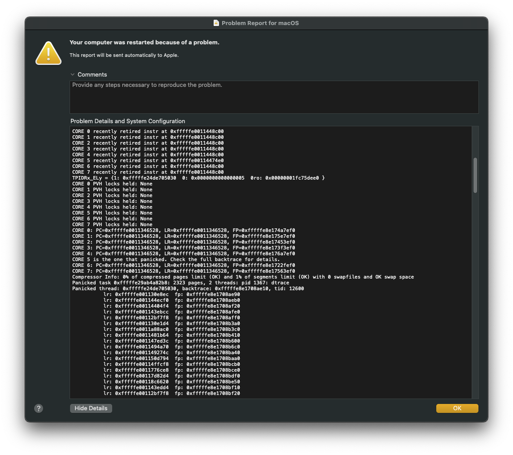
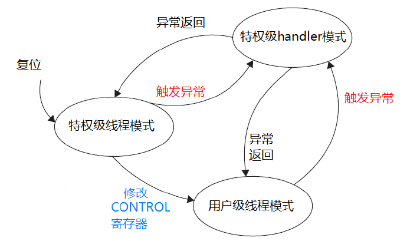
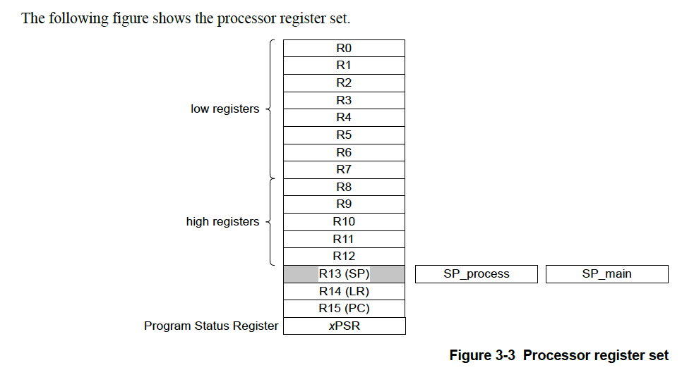

# ARM异常定位排查

## 背景
在日常开发中，我们难免会遇到程序跑飞的问题，而如何定位到问题所在点一直是棘手的难题，尤其是嵌入式产品的特性，作为核心部件处于电子产品内部，也不会暴露调试接口，
装机后就没这么容易现场调试了，要是量产后的产品出现问题就更难排查了，因此完善的异常记录机制和掌握分析技能显得尤其重要。如果我们能够将跑飞时的系统的
“快照”给记录下来（如当时的寄存器值，堆栈信息），将大大加快定位问题的速度。
举个例子，在macos/iOS arm架构平台中，若内核崩溃，也会生成一份异常报告，该报告也包含了寄存器，堆栈信息的快照，通过此报告，开发者可以更加容易定位系统崩溃的原因。

    

图例为基于ARMv8架构的Apple M1处理器 在kernel panic时的coredump,可以看到包含处理器的PC，LR寄存器信息。

## 前置知识
### 什么是异常？按照ARM技术文档的描述:
> Exceptions are taken whenever the normal flow of a program must temporarily halt, for
example, to service an interrupt from a peripheral. Before attempting to handle an exception, the
processor preserves the critical parts of the processor state so that the original program can
resume when the handler routine has finished.     

可以看出，此异常并非字面上的意思，而是只要是打断程序正常运行顺序的，包括中断，都算是异常情况。   

### 什么是特权分级？   
在ARM Cortex-M内核中，处理器有两种权限分级--特权级(Privileged mode)和用户级(User mode)，使得用户程序代码不能意外或故意的执行到涉及要害的操作，
如修改pc寄存器值等等。在用户级进入特权级的唯一办法就是进入异常，因为异常运行在特权级。在异常中可以指定返回的状态。
    
图例：合法的操作模式转换图

### 寄存器组：
关于寄存器的描述这里不再阐述，我们需重点关注的是R14寄存器,该寄存器是连接寄存器（LR），它的作用是调用子程序时存储返回的地址。   
      
图例: ARM Cortex-M 寄存器组

## 实践
当我们程序不小心访问野指针，内存、堆、栈溢出，访问非法地址等；亦或是硬件原因，如超频，电压波动等情况进入hardfault（有些处理器也称为abort）异常时，该如何定位到底是哪里出现问题呢？   
还记得前面提到的R14寄存器吗？它的值就是进入异常前的跳转地址，我们通过该地址，可以尝试定位出现问题的代码。
如何获取其值呢？我们在异常中断服务函数中获取寄存器组的值，下面给出gcc语法代码片段：   
*注：例子适用于gcc编译器，若是armcc编译器，请理解思路后稍作修改。*

```c
//change to system mode to read actual R14 value,which known as link registers.
__asm volatile ("CPS #0x1f");

__asm volatile ("mov %0,lr":"=r"(regs.lr));
__asm volatile ("mov %0,pc":"=r"(regs.pc));
__asm volatile ("mov %0,sp":"=r"(regs.sp));
__asm volatile ("mrs %0,cpsr":"=r"(regs.cpsr));
__asm volatile ("mov %0,r0":"=r"(regs.r0));
__asm volatile ("mov %0,r1":"=r"(regs.r1));
__asm volatile ("mov %0,r2":"=r"(regs.r2));
__asm volatile ("mov %0,r3":"=r"(regs.r3));
__asm volatile ("mov %0,r4":"=r"(regs.r4));
__asm volatile ("mov %0,r5":"=r"(regs.r5));
__asm volatile ("mov %0,r6":"=r"(regs.r6));
__asm volatile ("mov %0,r7":"=r"(regs.r7));
__asm volatile ("mov %0,r8":"=r"(regs.r8));
__asm volatile ("mov %0,r9":"=r"(regs.r9));
__asm volatile ("mov %0,r10":"=r"(regs.r10));
__asm volatile ("mov %0,r11":"=r"(regs.r11));
__asm volatile ("mov %0,r12":"=r"(regs.r12));
__asm volatile ("mov %0,r13":"=r"(regs.r13));
__asm volatile ("mov %0,r14":"=r"(regs.r14));

// do something，dump stacks,heaps,whatever you want.
// ....

//change back to abort mode
__asm volatile ("CPS #0x17");
```

上面的代码片段主要做的操作是使用C语言内嵌汇编指令将寄存器组的值存放到自定义的结构体变量中，在存储之前，需要确保处理器模式可以访问到R14（LR）寄存器。若无法访问或者在该模式下访问的寄存器值并不是user mode下的值，则需要将模式修改为可访问的模式，例如system mode，但不要设置为user mode，否则，你就不在特权模式下了。切换到可以读取寄存器值的模式下后，我们就使用汇编指令`MOV`将通用寄存器的值赋值给变量即可。

此时我们已经拿到了发生异常的现场，我们可以更进一步，堆栈信息也一并记录下来，然后通过串口，flash等方式将其打印
或者保存起来。。。至于怎么做，就由开发者自由发挥了。

好了 我们现在已经拿到r14寄存器的值了，这个值就是发生问题时的地址，我们该如何定位到出现问题的代码行数呢？这时候我们就需要用到gcc工具链里面提供的`armobjdump`，这是一个反汇编工具，通过反汇编，我们可以找到地址对应的汇编指令及函数标识。

下面是强制制造内存溢出，并通过r14寄存器值定位的例子：

```c
void main(void)
{
    //...do something
    uint8_t overflowTestData[1];
    //copy 4294967295 bytes,cause overflow
    memcpy(overflowTestData,0,0xFFFFFFFF);

}
```
运行后进入异常中断，假设在异常处理函数中取得的r14的内存地址为：`0x00474BF0`，我们把这个地址记录下来。
使用armobjdump反编译编译生成的二进制执行文件：`armobjdump -d myapp.out`，运行完毕后搜索以上地址，得到下面内容：

```asm
...
00474bd0 <testApp>:
00474bd0: 00 48 2d e9   push    {r11, lr}
00474bd4: 10 d0 4d e2   sub     sp, sp, #16
00474bd8: 0c 00 8d e5   str     r0, [sp, #12]
00474bdc: 08 10 8d e5   str     r1, [sp, #8]
00474be0: 07 00 8d e2   add     r0, sp, #7
00474be4: 00 10 a0 e3   mov     r1, #0
00474be8: 00 20 e0 e3   mvn     r2, #0
00474bec: 0a aa ff eb   bl      #-88024 <__aeabi_memcpy8>
00474bf0: ff ff ff ea   b       #-4 <testApp+0x24>
00474bf4: 64 00 a0 e3   mov     r0, #100
...
```
我们将lr的值-4，得到的值是`0x00474bec`，很显然，就是这条memcpy指令导致系统跑飞。

上面通过lr能够找到程序出错位置的，一般是精确错误（precise error），当然还有很多情况是lr寄存器也无法定位到问题，比如不精确错误（imprecise error）发生时，是很难找到问题的，处理器已经执行几个机器周期之后了，
内核也不会记录这期间的程序跳转动作，那就只能阅读代码，反复推演，缩小范围了。

## 总结
调试找bug的时间其实占用了开发周期的大部分时间，hardfault也是mcu开发人员的恶梦，意味着产品死机，后果可大可小，如何在系统跑飞时记录下日志就像案发现场一样，是我们破案的关键。本文不能覆盖到所有的ARM核版本，
比如你用的是Cortex-m核，还可以通过错误标志查询是总线错误还是内存保护错误，还是硬错误；更为复杂的ARMv8内核则通过CPSR寄存器进行进一步的分析，比如ALU计算单元最近运行的指令，执行最多的指令等等，因此本文只是提供了大概的思路，希望能够帮到大家。

优秀的产品需要确保0 hardfault以及安全冗余机制，确保系统能够安全可靠的运行.在平时编码中，注意以下几点，就能规避很多hardfault的发生:
1. 尽量避免使用动态内存，能静态分配就静态分配
2. memcpy，memset等涉及内存操作的，需做长度保护
3. 函数入参做检查，避免传入空指针操作
4. 操作指针需知道自己在做什么
5. 使用临时变量时需要考虑堆栈是否够大，尽量避免在函数内创建大数组
6. 设计结构体时，考虑到字节对齐问题

## 附录
收录了一些异常处理相关的文章   
[CmBacktrace: ARM Cortex-M 系列 MCU 错误追踪库](https://gitee.com/RT-Thread-Mirror/CmBacktrace)   
[Cortex-M内核芯片Hardfault硬件异常调试分析定位](https://www.bilibili.com/video/BV15R4y1L7WH/)


# Troubleshooting Guide for ARM Exception

## Background
In our daily development of embedded device, it's hard to avoid our code run into somewhere you not expected.Locating the exact crash point has always been a challenging task, 
and it's even harder to debug after massive produced, because it's inside the product and have no debug interface be able to access.Therefore, having a better exception recording mechanism is need.
If we can capture the moment when our system crashed, it will significantly speed up the time we looking for the problem.  
For example, in Apple ARM based MacOs and iOS platform, when a kernel panic occurs,a report will be generated. This report contains cpu register set, stack snapshot, which make developer easily
to know what happen when kernel is panic.
    
coredump logs when kernel panic on ARMv8 based Apple M1 SoC,which contain cpu PC,LR register information.

## Knowledge you should know
### what is exceptions? According to the ARM Architecture Reference Manual:
> Exceptions are taken whenever the normal flow of a program must temporarily halt, for
example, to service an interrupt from a peripheral. Before attempting to handle an exception, the
processor preserves the critical parts of the processor state so that the original program can
resume when the handler routine has finished.     

### what is privileges?
In ARM Cortex-M,there are two privileges--`Privileged` mode and `User` mode. This ensures that user cannot accidentally or intentionally execute harmful codes,
such as modifying the PC register. The only way to enter privileged mode is through exceptions, as exceptions run in privileged mode. In privileged mode, the return
mode can be specified.

    

state diagram for mode change   

### Register set：
We won't go into detail about the registers. However, we need to focus on the r14 register, also known as the link register(LR), it receives the return address when a Branch 
with Link (BL or BLX) instruction is executed.

         

ARM Cortex-M register set    

## Practice
When our code accidentally accesses a null pointer, invalid address, heap or stack overflow, or due to the hardware reasons such as overclocking,voltage fluctuations, its enter
hardfault(some processor may call it abort)exception. How can we locate the exact point where the problem occurred? Remember the r14 register mentioned earlier? Its value represents
the jump address before entering the exception. According the address,we may have a chance to locate the crash point.  
How can we get its value? We can obtain the values of the register set in the exception handler.   
*Note: The example is applicable to the GCC compiler. If you using the armcc compiler, modifications may be required.*
```c
//change to system mode to read actual R14 value,which known as link registers.
__asm volatile ("CPS #0x1f");

__asm volatile ("mov %0,lr":"=r"(regs.lr));
__asm volatile ("mov %0,pc":"=r"(regs.pc));
__asm volatile ("mov %0,sp":"=r"(regs.sp));
__asm volatile ("mrs %0,cpsr":"=r"(regs.cpsr));
__asm volatile ("mov %0,r0":"=r"(regs.r0));
__asm volatile ("mov %0,r1":"=r"(regs.r1));
__asm volatile ("mov %0,r2":"=r"(regs.r2));
__asm volatile ("mov %0,r3":"=r"(regs.r3));
__asm volatile ("mov %0,r4":"=r"(regs.r4));
__asm volatile ("mov %0,r5":"=r"(regs.r5));
__asm volatile ("mov %0,r6":"=r"(regs.r6));
__asm volatile ("mov %0,r7":"=r"(regs.r7));
__asm volatile ("mov %0,r8":"=r"(regs.r8));
__asm volatile ("mov %0,r9":"=r"(regs.r9));
__asm volatile ("mov %0,r10":"=r"(regs.r10));
__asm volatile ("mov %0,r11":"=r"(regs.r11));
__asm volatile ("mov %0,r12":"=r"(regs.r12));
__asm volatile ("mov %0,r13":"=r"(regs.r13));
__asm volatile ("mov %0,r14":"=r"(regs.r14));

// do something，dump stacks,heaps,whatever you want.
// ....

//change back to abort mode
__asm volatile ("CPS #0x17");
```
The code show above mainly doing one thing:save the registers set value into a custom structure. Before saving the registers values,make sure the processor can access the r14(LR). If you cannot access,
you need to change the processor mode into system mode or a mode can be access user mode register in privileged mode. Then just use asm instructions `MOV` and `CPSR` to storage value into variables.

As this point, we have the context of the exception occurrence. Now we can go further: dump the thread info, stack and heap info,print then through the uart, or saving to flash.

Okay, now we got everything. How can we locate the line of the code where the problem occurred? Oh here it is, we will using a disassembly tool call `armobjdump`, which provided in gcc toolchains.
By disassembly the code, it allows us to find the assemble instructions and identifiers corresponding to the address.

Here is a example to cause a memory overflow:
```c
void main(void)
{
    //...do something
    uint8_t overflowTestData[1];
    //copy 4294967295 bytes,cause overflow
    memcpy(overflowTestData,0,0xFFFFFFFF);

}
```
After running, the code crash and run into exception as expected. Assuming that the r14 value is `0x00474BF0`, we record this address,
then use `armobjdump`to disassemble our executable binary:`armobjdump -d myapp.out`.After running this tools, search for `0x00474BF0`
and get the following content:
```asm
...
00474bd0 <testApp>:
00474bd0: 00 48 2d e9   push    {r11, lr}
00474bd4: 10 d0 4d e2   sub     sp, sp, #16
00474bd8: 0c 00 8d e5   str     r0, [sp, #12]
00474bdc: 08 10 8d e5   str     r1, [sp, #8]
00474be0: 07 00 8d e2   add     r0, sp, #7
00474be4: 00 10 a0 e3   mov     r1, #0
00474be8: 00 20 e0 e3   mvn     r2, #0
00474bec: 0a aa ff eb   bl      #-88024 <__aeabi_memcpy8>
00474bf0: ff ff ff ea   b       #-4 <testApp+0x24>
00474bf4: 64 00 a0 e3   mov     r0, #100
...
```
By subtracting 4 from the lr value, we get `0x00474bec`,which obviously show that it's the memcpy causing the problems.

Be able to use lr to locate where the problems is, usually is precise error.However, there are many cases that lr registers can't locate the problem, such as when
an imprecise error occurs. It is difficult to find the problem because the processor has already executed several cycles, and ARM will not record those jumps. In 
that case,you need to read the code patiently, and narrow down the scope may cause problems.

## Summary
The time spent in debugging actually occupies most of your development time. Hardfault also is the nightmares for mcu developers, as they means the device is malfunction.
Recording logs when the system crash is like taking a photo at crime scene, like the evidence.This article cannot cover all ARM processors, for example,if you are using Cortex-M,
you also can know what causing the hardfault, it's a bus fault or memory fault occurs? For the more complex A profile processor such as ARMv8, you can perform further analysis using
the CPSR register. Therefore, this article only provides a idea and hopes to be helpful for you.

An excellent products need to ensure no hardfault,having a secure redundancy is also required.
So in daily development, pay attention to the following rules can avoid many hardfaults. 
1. Avoid using dynamic heap alloc, such as malloc(),free().using static allocation instead.
2. Ensure length and address verify when using `memcpy()`,`memset()`
3. Check function parameters to avoid operation on null pointers.
4. Understand what you are doing when manipulating pointer.
5. Consider whether the stack is large enough when using local variables.
6. Consider address align when designing a data structure.

## Appendix 
[CmBacktrace: ARM Cortex-M 系列 MCU 错误追踪库](https://gitee.com/RT-Thread-Mirror/CmBacktrace)   
[Cortex-M内核芯片Hardfault硬件异常调试分析定位](https://www.bilibili.com/video/BV15R4y1L7WH/)
