# 小米自研操作系统-Vela系统浅析   
今晚是米粉的狂欢夜，小米自研操作系统--澎湃OS正式发布，作为米粉一员，当看到其操作系统里的创新，也是非常欣慰的。

雷军在公众号中提到：  
> 在最底层的系统内核层，我们将自研的Vela系统内核与深度修改的Linux系统内核进行融合，重构了性能调度、任务管理、内存管理、文件管理等各个基础模块，实现了性能、效率的大幅提升。这一全新的融合内核，**支持200多个处理器平台、20多种文件系统，还能根据硬件能力差异灵活配置，具有很好的兼容性**，使得每个独立设备的性能都能得到彻底解放。  
> 
>在系统内核层之上的服务与框架层，我们将安卓的服务框架和自研Vela系统的服务框架，都作为“中间件”纳入其中；同时，全新打造了8大子系统，其中全新的AI子系统融合大模型能力，成为整个系统的“智能大脑”，不仅可以让单设备实现极强的端侧AI能力，同时赋予整个生态智能能力。
<center>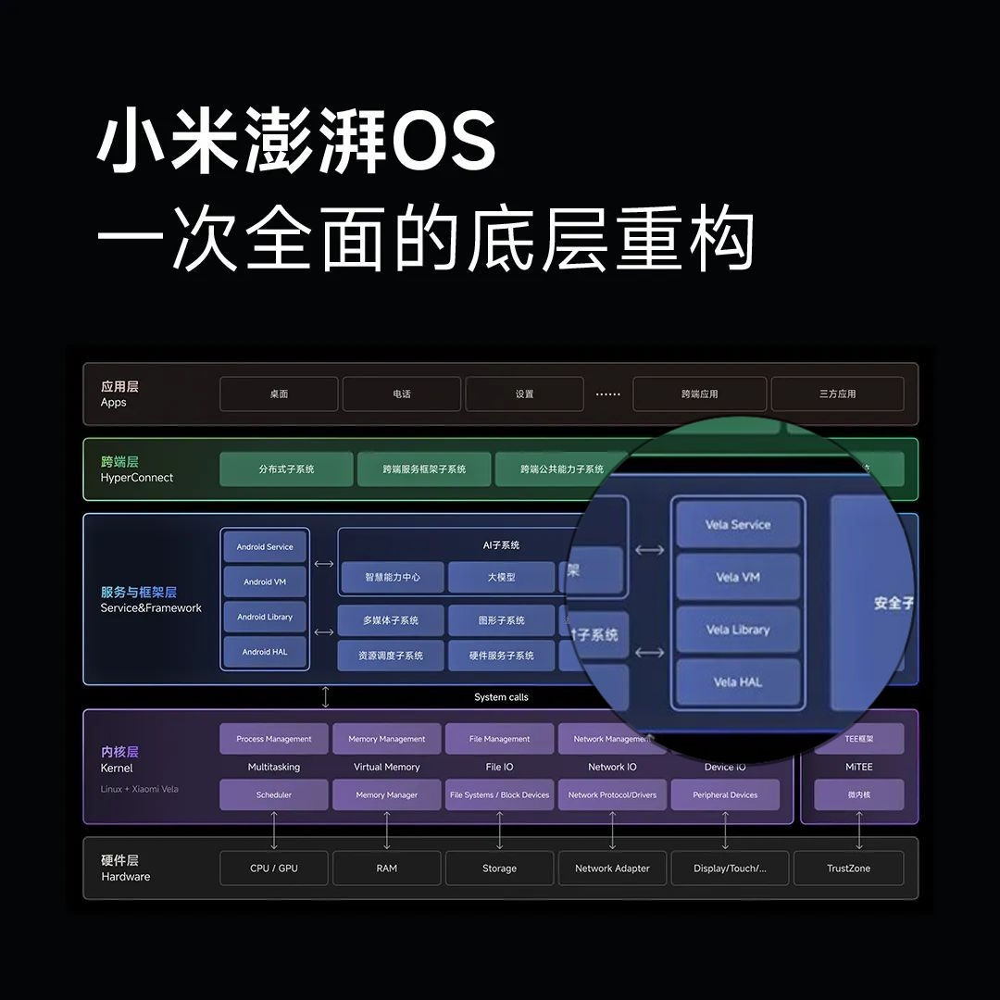</center>
<center>小米自研系统框图</center>

雷军在文中提及的Vela，熟悉物联网开发的朋友可能就有所耳闻，它就是小米的嵌入式操作系统，应用于米家的智能家居产品上。而Vela便是基于NuttX RTOS打造的，接下来将会浅析下为什么小米会使用NuttX作为其实时操作系统。
<center>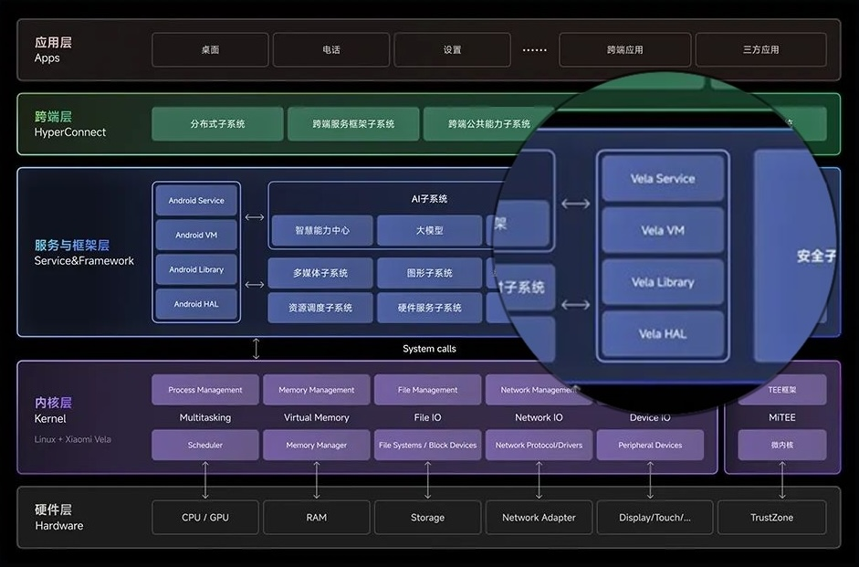</center>
<center>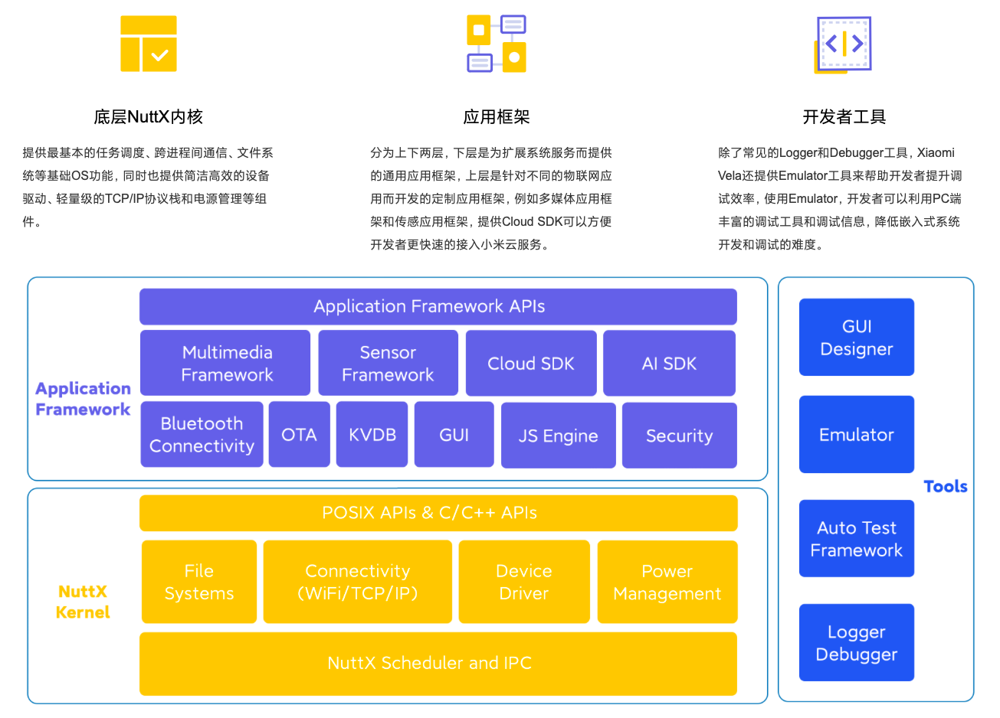</center>
<center>Xiaomi Vela系统框图</center>
<center>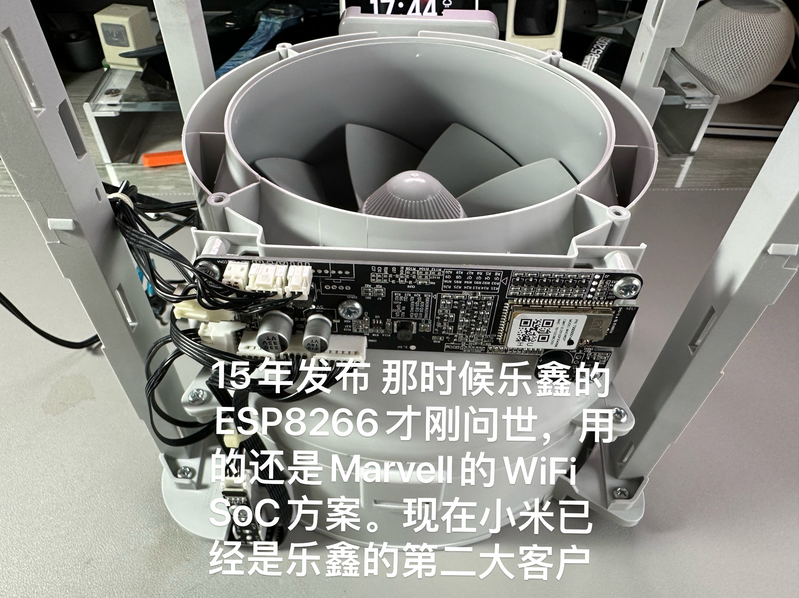</center> 
<center>笔者的米家设备--小米空气净化器</center>

## 关于NuttX操作系统
NuttX是一个成熟的实时操作系统，于07年由Gregory Nutt先生正式开源，2016年被三星选为TizenRT操作系统的内核，2019年在小米的推动下正式进入Apache基金会，经过开源社区多年的不懈努力，NuttX功能丰富，性能稳定，商业化成熟度高，Fitbit最近两代的手环产品和索尼多款消费级产品都是基于NuttX开发的。<sup>1</sup>
<figure>
    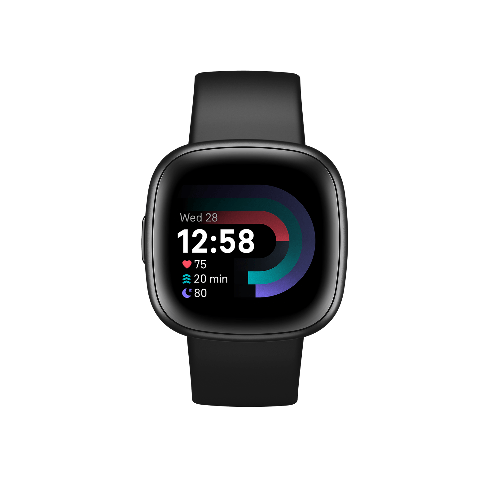  
    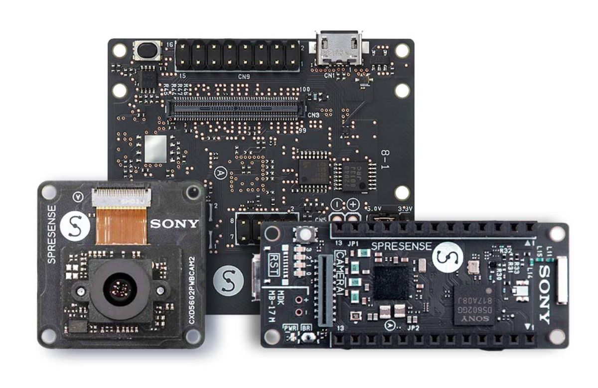  
</figure>

## 为什么选择NuttX
市场上开源或商业的RTOS非常多，为什么最终选择NuttX作为Xiaomi Vela的基础？主要有以下几个原因：
NuttX对POSIX标准有原生兼容：NuttX是可商用化RTOS中**唯一一个对POSIX API有原生支持**的实时操作系统，**所以很多Linux社区的开源软件可以很方便的移植到NuttX上**，这样可以极大的简化开源软件移植，方便代码复用，降低学习曲线，其它RTOS需要适配层把POSIX API转成内部API，而且通常只兼容一小部分的POSIX接口。
- 完成度高：NuttX集成了文件系统、网络协议栈、图形库和驱动框架，减少开发成本。
- 模块化设计：所有组件甚至组件内部特性，都可以通过配置Kconfig来调整或关闭，可按需对系统进行裁剪，适用于不同产品形态。
- 代码精简：所有组件都是从头编码，专门对代码和数据做了优化设计。
- 轻量级：虽然NuttX实现了传统操作系统的所有功能，但是最终生成的代码尺寸还是可以很小（最小配置不到32KB，最大配置不超过256KB）。
- 和Linux系统的兼容性：因为NuttX整体设计、代码组织，编译过程和Linux非常接近，将会极大地降低Android/Linux开发者的迁移成本。
- 活跃开放的社区：很多厂商（比如小米、Sony，乐鑫、NXP等）和开源爱好者都在积极回馈社区。<sup>1</sup>

市场上主流的RTOS产品：
<figure>
      
    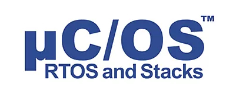  
        
      
      
</figure>

- FreeRTOS （开源，主流商用产品使用的操作系统，如出货量过亿的ESP82xx,ESP32模组)
- μC/OS （商业需授权，"好奇号"火星登陆车科学仪器SAM采用）
- Zephyr (开源，Linux基金会托管)
- NuttX  (开源，Apache基金会托管)
- VxWorks（闭源，"好奇号"火星登陆车自动着陆系统采用）

笔者使用过FreeRTOS,μC/OS,Zephyr,以及国产的RT-Thread；各有其的优缺点。初探NuttX感觉RT-Thread的设计思路非常的相似，而NuttX更进一步，完全兼容POSIX接口，也有着丰富的组件，支持几百种处理器平台，这也是小米有信心说其自研操作系统支持200多个处理器平台的底气。

## NuttX的系统架构
从纵向看，NuttX和传统操作系统一样由调度子系统、文件子系统、网络子系统、图形子系统和驱动子系统组成。从横向看，NuttX向上给应用程序提供了POSIX和ANSI定义的标准C/C++接口。对于没有标准化的组件（比如各种外设），NuttX通常会提供兼容Linux的API。向下NuttX定义了Arch API、块设备驱动接口、网卡驱动接口、display驱动接口，以及各种总线和外设的lower half驱动接口，使得芯片厂商能够规范、快速地完成移植工作。下图中数量众多的蓝色模块就是NuttX实现的各种功能。<sup>1</sup>

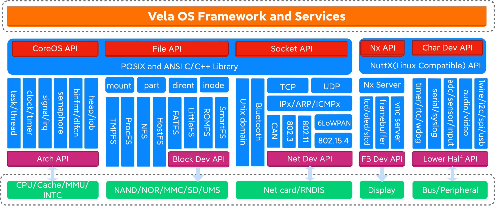  

## Hello NuttX！
心动不如行动，既然NuttX说的这么厉害，怎么能不点个灯打印个```helloworld！```?笔者打开抽屉，找到了之前十块钱购买的ESP32-C3开发板，实战开始！
<center>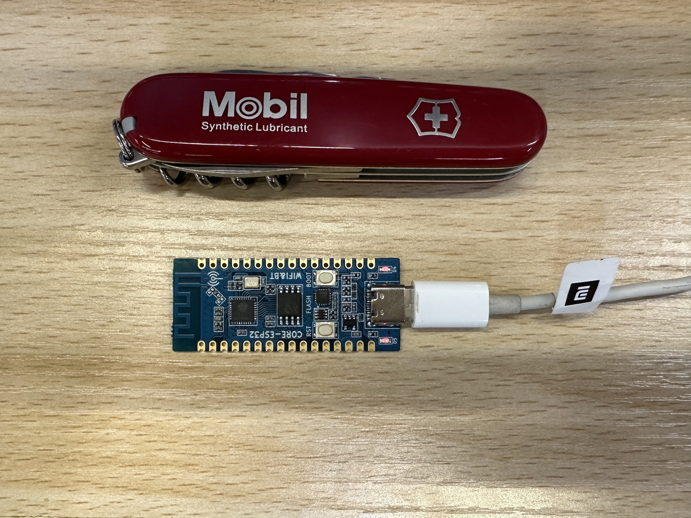</center>  

- Wi-Fi and Bluetooth 5 (LE) connectivity  
- 32-bit RISC-V single-core processor, up to 160 MHz  
- CoreMark® score:
– 1 core at 160 MHz: 407.22 CoreMark; 2.55 CoreMark/MHz
- 384 KB ROM
- 400 KB SRAM (16 KB for cache)
  
## Step1:
请访问 https://nuttx.apache.org/docs/latest/index.html 并follow Getting Started章节，本文不再阐述，需要夸赞的是，NuttX的编译工具链支持非常完善，而且支持Linux，MacOS系统，笔者使用M1 Mac没有遇到其他工具链搭建问题，一气呵成。
## Step2:
请访问 https://nuttx.apache.org/docs/latest/platforms/risc-v/esp32c3/index.html#esp32-c3-toolchain 该链接为ESP32-C3 目标板的工程配置
## Step3:
根据Step2，此时我们已经编译出固件并且在目标板上运行了。打开我们的串口，输入回车，有没有发现该界面非常熟悉？没错，这就像我们linux中的终端，具备shell命令解析，系统挂载，程序加载等等功能，在NuttX上我们称之为nsh
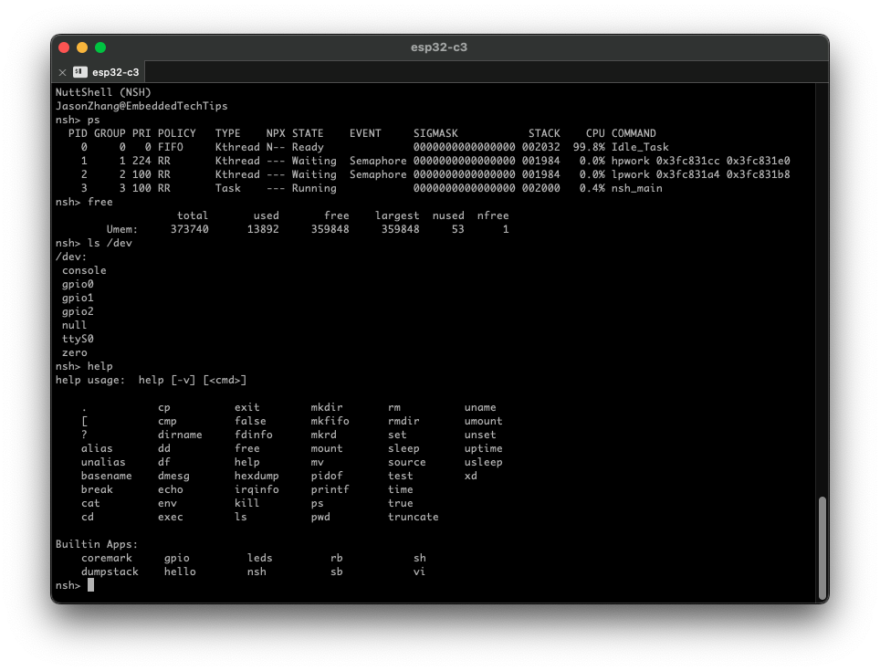 

也有可能有读者疑惑？这完全不像单片机的逻辑呀？我的main在哪，程序该怎么跑？不急，我们慢慢分析。NuttX不像其他普通rtos，而是像Linux，分为了内核态和用户态。

通过阅读源码，我梳理出了NuttX启动的大致流程：
 

其实这个nsh也是个应用程序，通常是作为第一个用户程序。我们可以通过nsh去调用我们的程序，或者像linux一样，设置自启动。
## Step4:helloworld！
接下来我们编写一个nsh调用的应用程序，该程序将会创建两个线程，并分别定时打印```helloworld!```
我们首先配置工程，基于其例子修改。输入```make menuconfig``` 选择(Top) > Application Configuration > Examples下的"Hello,world!" example (menuconfig,搞过Linux内核的同学狂喜，没想到单片机也能这样配置了)
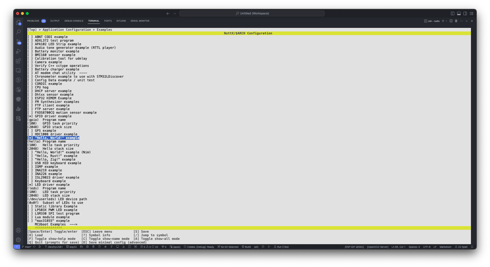 
选中后保存退出，打开apps目录下的```examples/hello/hello_main.c```
修改为以下代码：
```c
#include <nuttx/config.h>
#include <stdio.h>

static int my_task1(int argc, char *argv[])
{
    uint32_t i=0;
    while(1)
    {
        printf("my_task1 is running...%ld\r\n",i++);
        sleep(1);
    }
    return 0;
}

static int my_task2(int argc, char *argv[])
{
    uint32_t i=0;
    while(1)
    {
        printf("my_task2 is running...%ld\r\n",i++);
        sleep(2);
    }
    return 0;
}

int main(int argc, FAR char *argv[])
{
    task_create("my_task1",10,1024*1,my_task1,NULL);
    task_create("my_task2",11,1024*1,my_task2,NULL);
    while(1)
    {
        sleep(1);
    }
    return 0;
}

```
最后保存退出，重新编译下载到目标板上，在nsh终端中输入```hello```：
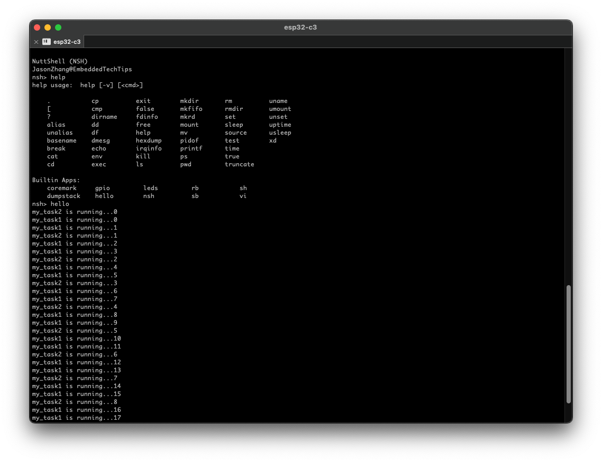 
我们可以看到，程序如期按照我们的想法运行。

# 总结
本文初探了小米自研操作系统中Vela嵌入式系统的基础--NuttX实时操作系统，并在乐鑫ESP32-C3这款芯片上简单跑了个hello world。与其他实时操作系统不同的是，我们编写的程序的所有接口都是ISO标准的POSIX接口，比如创建线程，延时，打印等等这些接口，**你在linux系统上一样能一动不动跑起来**，而不是每家rtos独有的接口，与硬件平台解耦，甚至不需要操作系统抽象层了。这样一来，非常方便应用程序在各平台上的移植，解放了开发者在不同平台中的适配，而是专注于应用本身的开发。同时，图形化的配置，丰富的组件（涵盖了网络协议，传感器，多媒体，到人工智能等等），满足了各种业务的快速搭建和开发，这是非常具有竞争力的。
而作为小米操作系统的一部份，我相信该rtos系统除了应用于现有小米的嵌入式产品外，还会如手机SoC（异构核）中的低功耗核，MCU岛，安全域中，与安卓深入融合，给设备带来更极致的性能表现；甚至后续还会应用在小米车载系统上。

PS:刚写完总结，小米宣布Vela全面开源啦！（不知道物联网服务能不能开放给个人用户呢？真的迫切想将自己做的东西接入米家！）有空基于Vela再点个灯。

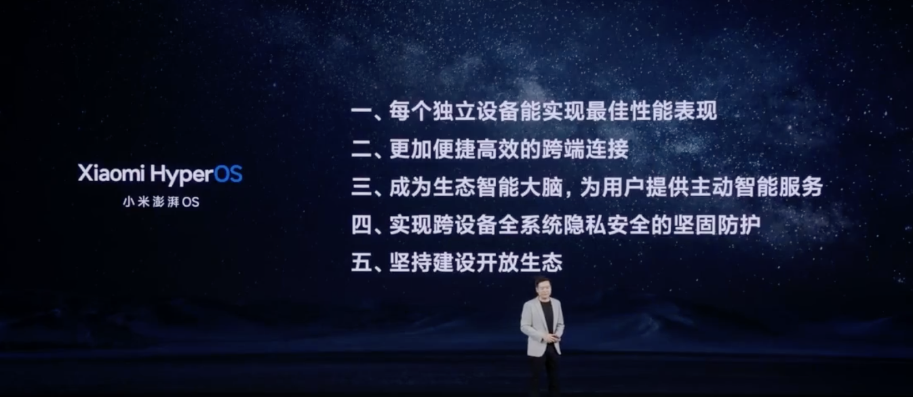 

<sup>1</sup>:https://iot.mi.com/vela/detail.html