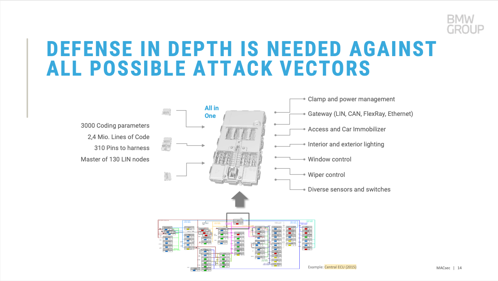

# 自动驾驶芯片-异构核专题1  

## 背景

如今，嵌入式系统越来越复杂。例如：

- 无人机：实时的传感器数据采集，如（陀螺仪、气压计、空速计等）并传给飞行控制系统进行复杂的算法计算、航线规划、三维自动驾驶。  

- 汽车自动驾驶：实时的传感器数据采集，如（摄像头、雷达）并将其处理为车辆的行驶情报、复杂的算法计算、实时车身控制量输出。

图：典型自动驾驶所具备的传感器

- 汽车电子架构：汽车电子架构越来越复杂，如今，一台高配汽车拥有超过100个ECU节点，如何简化系统？

图：主机厂面临的挑战

图：1957年宝马501的汽车电子架构

图：2015年宝马7系的汽车电子架构：中央计算 + 区域化电子电器架构，ECU数量达到63个

图：宝马2015年的中央ECU

图：宝马下一代架构

图：汽车行业正向着分布式-域集中-中央集中-中央计算的架构演化

在传统设计中，前面说到的产品功能需要多颗芯片来实现，如：独立的应用处理器+微控制器、微控制器+DSP、多个微控制器，这样的方式最显而易见有以下缺点：   

1. 增加电路复杂度和成本：由于每颗芯片都需要有外围电路，电路复杂度提升，成本上升。若是多节点的硬件，则会增加线缆、增加产品重量等。
2. 可靠性和安全性：由于芯片/节点间间通讯需要线路相连，有被侧信道攻击的危险。同时，由于电路复杂度增大，故障点也会增多。
3. 开发、认证、维护成本高，每一个MCU都有自己的操作系统和代码，复用性差。

**而高集成度All In One的异构核方案则很好的解决了这些痛点。**

## 异构核介绍

随着单核处理器的性能提升逐渐接近瓶颈， 摩尔定律失效，单核处理器已不能满足市场对性能的需求，多核架构也因此诞生。 处理器的发展经历了单核到多核的发展历程，多核处理器又分为同构多核、异构多核。

异构处理器是指在同一片晶片上集成了不同架构的处理器的系统级芯片，例如集成高性能的Cortex-A核+低功耗实时的Cortex-M核，有一些高性能异构核SoC还会集成DSP，GPU，加速引擎，如我们熟悉的智能手机SoC，苹果M系列桌面级SoC。

单核处理器： STM32F100C4T6B MCU
   ARM Cortex-M0

图：异构多核 三星猎户座9820移动处理器

-  ARM Cortex-A75 x2
-  ARM Cortex-A55 x4
-  ARM Cortex-M4 x2
-  GPU x2
-  NPU x2

图：异构多核 Apple M1 桌面级处理器

-  ARMv8 Base  "Firestorm" x4
-  ARMv8 Base  "Icestorm" x4
-  GPU x8
-  NPU x16
-  MCU

## 异构核的应用

- 汽车行业：

  - 例如前面所说到：汽车行业正向着分布式-域集中-中央集中-中央计算的架构演化，异构核可以做为中央计算平台、中央域控制器的大脑：

  

  
图：汽车电子中异构核的特点

  

图：一款超异构核的功能分配

- 无人机：
  - 将多颗芯片使用异构核替代，大幅提高系统性能的同时，可简化电子架构，减轻重量。

- 工业：

  - 机械臂

  - 工业机器人（AGV/AMR） 

在接下来的章节，笔者将会深入介绍一款自己实际开发过并用于量产产品的异构核芯片，敬请期待。

------

参考文献：

> https://standards.ieee.org/wp-content/uploads/import/documents/other/eipatd-presentations/2021/d1-01.pdf 
>
> https://standards.ieee.org/wp-content/uploads/import/documents/other/eipatd-presentations/2021/opening-remarks.pdf
